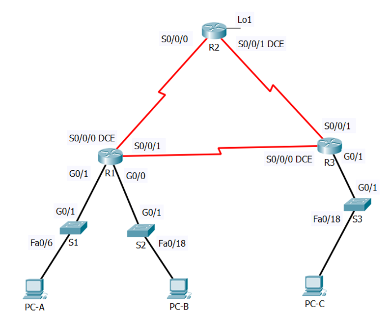
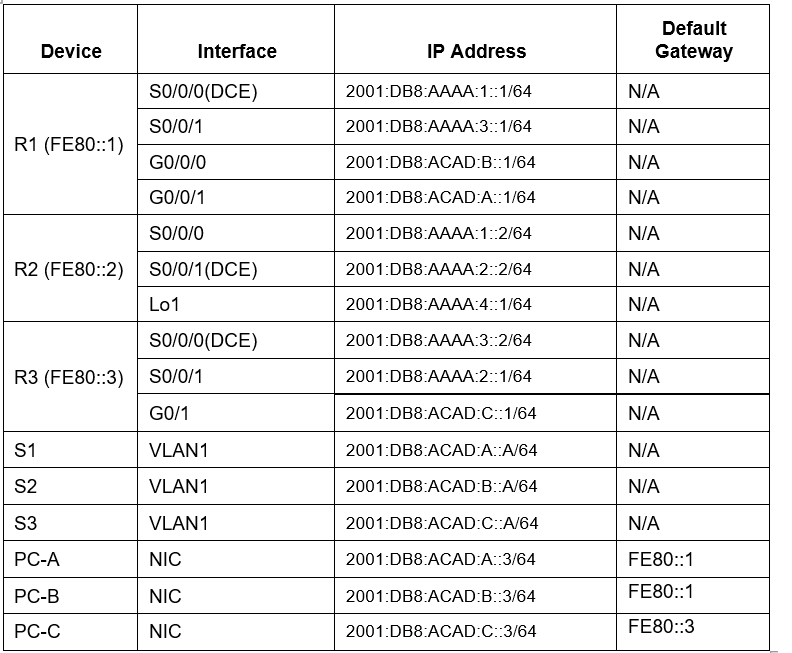

# Configuratie Opdracht 1: Cisco labo deel 1

## Topologie opstellen



1) Plaats alle toestellen zoals in de topologie afgebeeld staat, met volgende types: 
    * router: 4321
    * switch: 2960
2) voeg de module NIM-2T toe aan elke router om een serial interface te krijgen
3) verbind de toestellen:
    * tussen switches, routers en PC's: straight-through kabels
    * tussen de routers: met een serial kabel, zorg ervoor dat de DCE aan de juiste interface staat
4) Configureer IPv6 adressen (incl default gateway) op alle PC's zoals in de adresseringstabel staat


5) Configureer de switches

   * ```S(config)#no ip domain-lookup```
   * ```S(config)#hostname S{#}```
   * ```S(config)#ip domain-name ccna-lab.com```
   * ```S(config)#service password-encryption```
   * ```S(config)#banner motd & Toegang voor onbevoegden is verboden! &```
   * ```S(config)#username admin password classadm```
   * ```S(config)#enable secret class```
   * ```S(config)#line con 0```
   * ```S(config-line)#password cisco```
   * ```S(config-line)#login```
   * ```S(config)#line vty 0 15```
   * ```S(config-line)#login local```
   * ```S(config-line)#transport input ssh```
   * ```S(config)#crypto key generate rsa general-keys modulus 1024```
   * ```S(config)#sdm prefer dual-ipv4-and-ipv6 default```
   * ```S(config)#reload```
   * ```S(config)#int vlan 1```
   * ```S(config-line)#ipv6 address 2001:DB8:ACAD:A::A/64```
   * ```S(config-line)#no shutdown```
   * ```S(config)#ip ssh version 2```
   * ```S#copy run start```

   * ga naar de config van S1 en exporteer de startup config en load daarna deze file naar s2 en s3
   *  ```S(config)#reload``` (doe dit voor beide switches)
   *  ```S(config)#sdm prefer dual-ipv4-and-ipv6 default``` (doe dit opnieuw voor beide switches)
   *  ```S(config)#reload``` (doe dit voor beide switches)
   *  ```S(config)#hostname S{#}``` (doe dit voor beide switches)
   *  pas de vlan 1 zoals aangegeven op de addresseringstabel
   

   
 1) basisconfiguratie van de routers(doe dit voor alle routers)
 
  * ```R(config)#no ip domain-lookup```
  * ```R(config)#hostname R{#}```
  * ```R(config)#ip domain-name ccna-lab.com```
  * ```R(config)#service password-encryption```
  * ```R(config)#banner motd & Toegang voor onbevoegden is verboden! &```
  * ```R(config)#username admin password classadm```
  * ```R(config)#enable secret class```
  * ```R(config)#line con 0```
  * ```R(config-line)#password cisco```
  * ```R(config-line)#login```
  * ```R(config)#line vty 0 4```
  * ```R(config-line)#login local```
  * ```R(config-line)#transport input ssh```
  * ```R(config)#crypto key generate rsa general-keys modulus 1024```
  * ```R(config-line)#transport input telnet```
  * ```R(config)#ipv6 unicast-routing```
  * Export deze config en gebruik ze voor de andere routers, pas wel de hostnaam aan


  
configuratie ipv6 instellingen op de interfaces van de routers:
* ```R(config)#int {g|s}{0/X/X}```
* ```R(config-if)#ipv6 address {adres uit adresseringstabel}```
* ```R(config-if)#ipv6 address {ll-adres uit adresseringstabel} link-local```
* ```R(config-if)#ipv6 enable```
* ```R(config-if)#no shut```

voor de serial DCE interfaces moeten de clockrates aangepast worden:
* ```R(config)#int {s}{0/X/X}```
* ```R(config-if)#clock rate 128000```

configuratie OSPFv3:
alle LAN interfaces worden passive, routers krijgen een router id in de vorm van x.x.x.x, met x = hostnaam-nummer
ospf proces-id 10 en area 0

* ```R(config)#ipv6 router ospf 10```
* ```R(config-rtr)#passive-interface g0/0/0```
* ```R(config-rtr)#passive-interface g0/0/1```
* ```R(config-rtr)#router-id 1.1.1.1```
* ```R(config-rtr)#auto-cost reference-bandwidth 1000```
* doe dit voor elke router

Activeer op elke(!) interface ospf:
* ```R(config-if)#ipv6 ospf 10 area 0```

1) loopback interface aanmaken router 2
  
* ```R2(config)#int Loopback 1```
* ```R2(config-if)#ipv6 address 2001:DB8:AAAA:4::1/64```
* ```R2(config-if)#ipv6 address FE80::2 link-local```

Default route aanmaken voor dit loopback adres

* ```R2(config)#ipv6 route ::/0 Lo1```

Deze route moet verstuurd worden door ospf:

* ```R2(config-rtr)#default-information originate```
