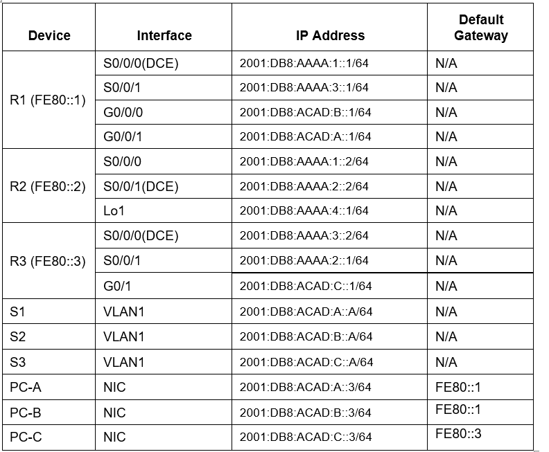

# Testplan Opdracht 1: Cisco labo deel 1

(Een testplan is een *exacte* procedure van de handelingen die je moet uitvoeren om aan te tonen dat de opdracht volledig volbracht is en dat aan alle specificaties voldaan is. Een teamlid moet aan de hand van deze procedure in staat zijn om de tests uit te voeren en erover te rapporteren (zie testrapport). Geef bij elke stap het verwachte resultaat en hoe je kan verifiëren of dat resultaat ook behaald is. Kies zelf de structuur: genummerde lijst, tabel, secties, ... Verwijder deze uitleg als het plan af is.)

Auteur(s) testplan: Nathan Staelens, Jordy Vanneste

## Topologie opstellen en configureren met het configuratiebestand

De topologie:


De adresseringstabel:




## Test de connectiviteit

1) Controleer op elke router of die zijn buren kent via ospf: ```show ipv6 ospf neighbor```

2) Controleer op elke router of ospf geactiveerd is op elke interface: ```show ipv6 ospf interface```

3) Controleer of de routes in de routers zijn aangeleerd met ospf, deze zijn aangeduid met 'O': ```show ipv6 route```

4) Elke PC, Switch en Router moet naar elkaar kunnen pingen m.b.v. volgend commando: ```ping [IPv6 adres]```

5) Test de opstelling door via ssh te verbinden met een willekeurige router/switch/pc vanuit een willekeurige PC:
```C:\ssh -l admin {ipv6-adres}```