# Testplan Cisco Labo Deel 2

Dit testplan zal u voortonen hoe dat u de configuratie van onze 2e cisco opdracht kan voltooien en testen

Auteur(s) testplan: Jarne Bottelberghe, Nathan Staelens

## Topologie opstellen en configureren met het configuratiebestand

De topologie:

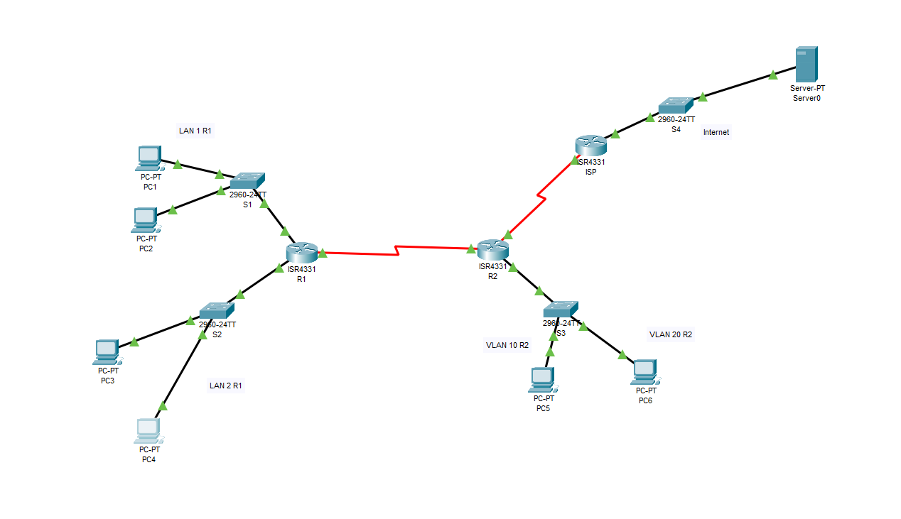


De adresseringstabel:

| Connectie   | LAN 1 R/64     | LAN 2 R1/64    | VLAN 10 R2/64  | VLAN 20 R2/64  | Seriële link R1-R2/64 |
| ----------- | -------------- | -------------- | -------------- | -------------- | --------------------- |
| IPV6 Addres | 2001:db8:A:7:: | 2001:db8:B:7:: | 2001:db8:C:7:: | 2001:db8:D:7:: | 2001:db8:ACDC:7::     |

U kan de configuratie van de diverse routers en switch raadplegen in het configuratieplan.
(dit is een markdown file in dezelfde map als dit testplan).
Als u dit configuratieplan hebt gevolgd dan kan u de volgende testen  doen.
!!!Vergeet niet alle end toestellen in te stellen zodat ze een ipv6 addres automatisch toegewezen worden

## Test de connectiviteit

1) Elke pc binnen het netwerk moet in staat zijn om naar de website systemengineeringproject.org te surfen

- Ga op een van de pc's (PC3-6) binnen het netwerk naar de web Browser.
   (deze kan u vinden onder het Desktop tabblad)

 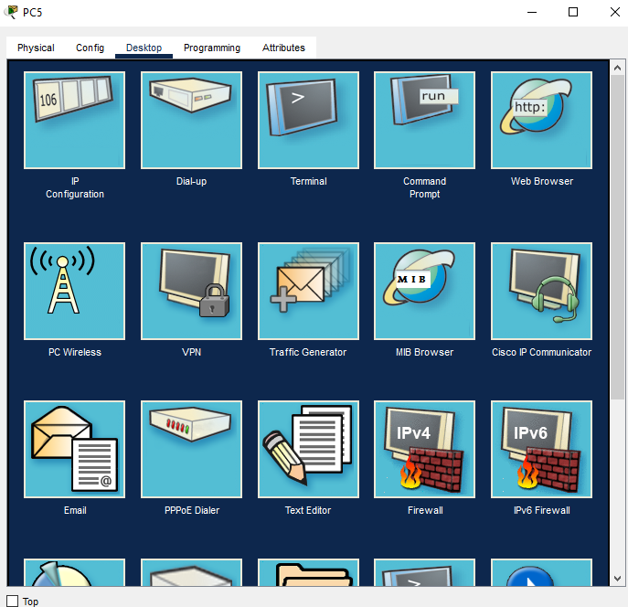

- Vul vervolgens de websitenaam (systemengineeringproject.org) in om te kijken als u hiermee kan connecteren.

   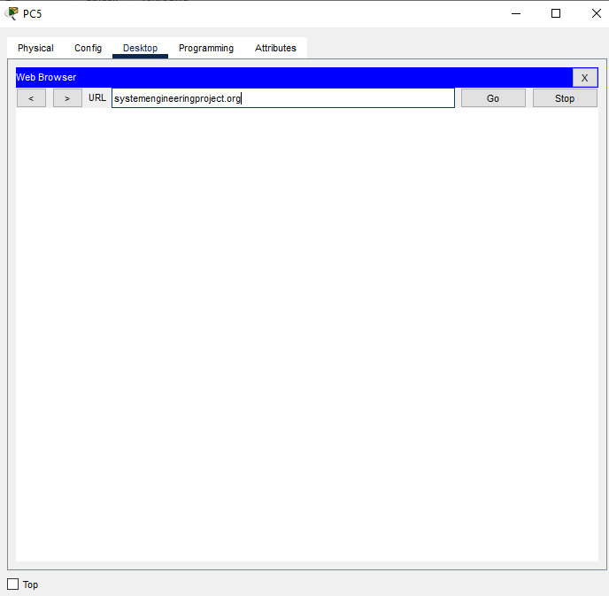

- PC-1 en PC-2 hebben geen dns server omdat deze gebruik maken van SLAAC. Ze kunnen wel naar de website browsen door rechtstreeks het adres van de server (2001:db8:1000::10) in te geven

 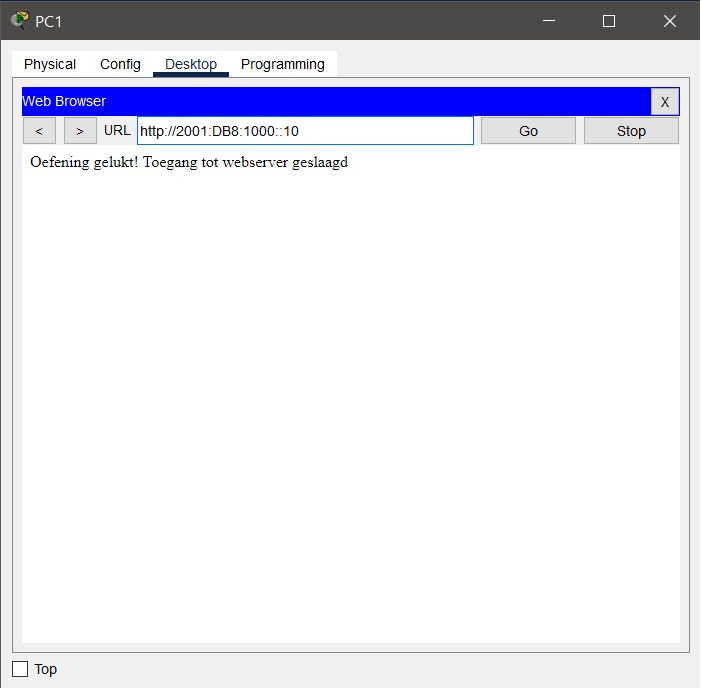

 Als u de zin "Oefening gelukt! Toegang tot webserver geslaagd" te zien krijgt op de website dan is het netwerk goed geconfigureerd, als u deze zin kan zien op elke pc dan is de oefening geslaagd 

   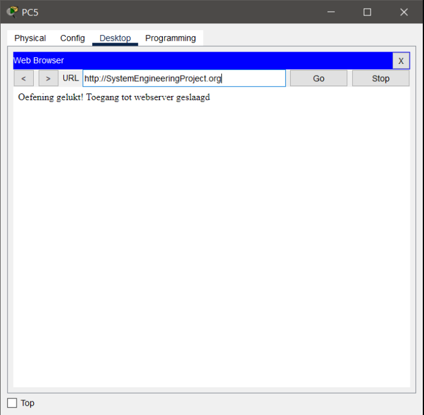

- Elke PC moet naar elkaar kunnen pingen en naar de webserver:
- 


## Test Stateless dhcpv6

- Controleer dat R1 de stateless dhcpv6 server is voor inteface g0/0/1 a.d.h.v. het commando ```show ipv6 dhcp interface```
- 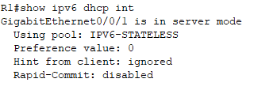

- PC-3 en PC-4 hebben een ipv6 adres en een dns-server adres gekregen via dhcp, controleer dit via IP configuration:
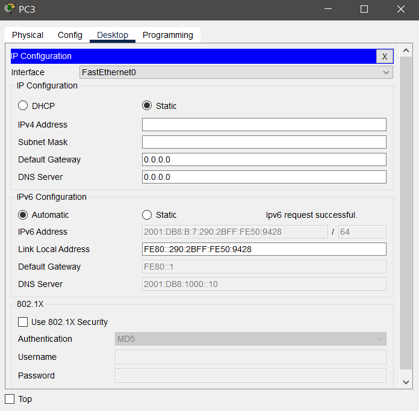

## Test Stateful dhcpv6

- Controleer dat R2 de dhcpv6 stateful server is voor de interfaces s0/1/0, g0/0/0.10 en g0/0/0.20 a.d.h.v. het commando ```show ipv6 dhcp interface```:
- 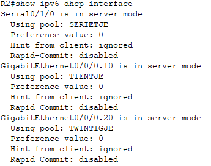

- Controleer dat R1 een client is voor stateful dhcp op interface S0/1/0; ```show ipv6 dhcp interface```:
- 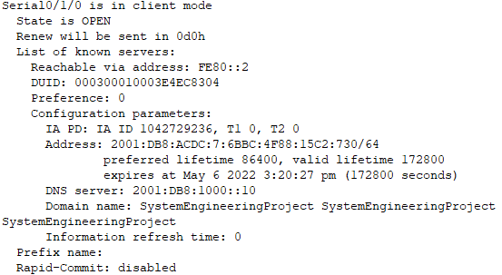


## Test routes


- Controleer dat op R1 er een default route is naar R2 a.d.h.v. het commando ```show ipv6 route```:
- 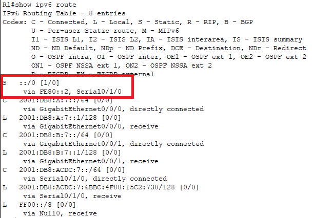

- Controleer dat op R2 er 2 directly connected standaard statische routes naar LAN1 en LAN2 zijn en een next hop statische route naar ISP a.d.h.v. het commando ```show ipv6 route```:
- 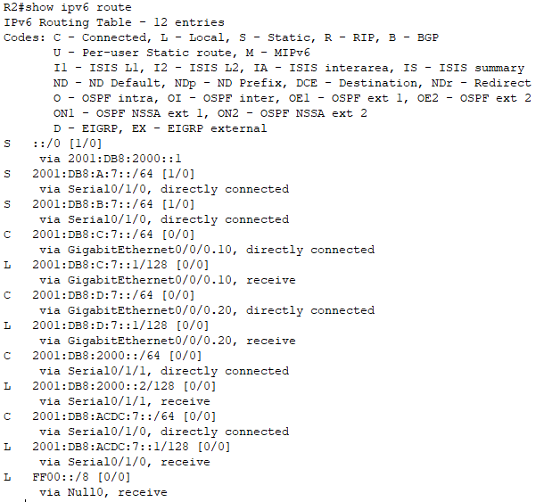


