# Configuratie Netwerk

## Topologie


## Ip Adrestabel 

Vlan 20 (14 hosts: 172.16.128.48/28 - 172.16.128.63/28 )

| Machine     | IP-adres      | Subnetmask      | IPV6-adres (enkel voor dns) |
| ----------- | ------------- | --------------- | --------------------------- |
| Agent Smith | 172.16.128.50 | 255.255.255.240 | 2001:DB8:ACAD:A::1/64       |
| Morpheus    | 172.16.128.51 | 255.255.255.240 | 2001:DB8:ACAD:A::2/64       |
| Trinity     | 172.16.128.52 | 255.255.255.240 | 2001:DB8:ACAD:A::3/64       |
| Neo         | 172.16.128.53 | 255.255.255.240 | 2001:DB8:ACAD:A::4/64       |
| The oracle  | 172.16.128.54 | 255.255.255.240 | 2001:DB8:ACAD:A::5/64       |
| SSH client  | 172.16.128.55 | 255.255.255.240 | 2001:DB8:ACAD:A::6/64       |
| ...         | ...           | ...             | ...                         |
| .           | 172.16.128.62 | 255.255.255.240 | 2001:DB8:ACAD:A::13/64      |


Vlan 30 (30 hosts: 172.16.128.0/27 - 172.16.128.31/28 )

| Machine        | IP-adres      | Subnetmask      |
| -------------- | ------------- | --------------- |
| R0/0/0.30      | 172.16.128.1  | 255.255.255.224 |
| Werkstation 1  | 172.16.128.2  | 255.255.255.224 |
| Werkstation 2  | 172.16.128.3  | 255.255.255.224 |
| Werkstation 3  | 172.16.128.4  | 255.255.255.224 |
| Werkstation 4  | 172.16.128.5  | 255.255.255.224 |
| ...            | ...           | ...             |
| Werkstation 30 | 172.16.128.30 | 255.255.255.224 |

Vlan 40 (14 hosts: 172.16.128.32/28 - 172.16.128.47/28 )

| Machine | IP-adres      | Subnetmask      |
| ------- | ------------- | --------------- |
| Gast 1  | 172.16.128.33 | 255.255.255.240 |
| Gast 2  | 172.16.128.34 | 255.255.255.240 |
| Gast 3  | 172.16.128.35 | 255.255.255.240 |
| Gast 4  | 172.16.128.36 | 255.255.255.240 |
| ...     | ...           | ...             |
| Gast 16 | 172.16.128.46 | 255.255.255.240 |

Vlan 50 (niet van toepassing)

## ConfiguratieVolgorde

1. Opzetten fysieke topologie = (Nathan en Gilles) 
2. Bekabeling op de tafel (Jorris en Jarne)
3. Configuratie router en switch (Nathan)
4. Opzetten dns server en webserver (Gilles)
5. Testen netwerk door middel van ping
6. Opzetten AD Domeincontroller (Jorris)
7. Opzetten Email server (Jarne)
8. Opzetten MDTserver (Gilles)
9. Opzetten MDTclient (Nathan)
10. Testen bereikbaarheid webserver, email server vanop de mdt client


## Configuratie Topologie

Opm:

- int g0/0/0 is voor lan, g0/0/1 is voor buiten

## Configuratie

### Configuratie S1 VLAN

* ```Switch(config)#hostname S1```
* ```S1(config)#no ip domain-lookup```
* ```S1(config)#banner motd " Je moet ut mn schuvn bluvn! "```
* ```S1(config)#vlan 20```
* ```S1(config-vlan)#name LANSERVERS```
* ```S1(config-vlan)#vlan 30```
* ```S1(config-vlan)#name LANWORKSTATIONS```
* ```S1(config-vlan)#vlan 40```
* ```S1(config-vlan)#name LANGUESTS```
* ```S1(config-vlan)#exit```
* ```S1(config)#int range F0/6-10```
* ```S1(config-if-range)#switchport mode access```
* ```S1(config-if-range)#switchport access vlan 20```
* ```S1(config-if-range)#no shut```
* ```S1(config-if-range)#exit```
* ```S1(config)#int range f0/1-5```
* ```S1(config-if-range)#switchport mode access ```
* ```S1(config-if-range)#switchport access vlan 30```
* ```S1(config-if-range)#no shut```
* ```S1(config-if-range)#exit```
* ```S1(config)#int range f0/11-12```
* ```S1(config-if-range)#switchport mode access```
* ```S1(config-if-range)#switchport access vlan 40```
* ```S1(config-if-range)#exit```
* ```S1(config)#int g0/1```
* ```S1(config-if)#switchport mode trunk ```
* ```S1(config-if)#no shut```
* ```S1(config-if)#exit```


### Configuratie R1 Router-on-a-stick

* ```Router(config)#hostname R1```
* ```R1(config)#no ip domain-lookup```
* ```R1(config)#banner motd " Je moet ut mn schuvn bluvn! "```
* ```R1(config)#int g0/0/0```
* ```R1(config-if)#no shut```
* ```R1(config-if)#int g0/0/0.20```
* ```R1(config-subif)#description VLANSERVERS```
* ```R1(config-subif)#encapsulation dot1Q 20```
* ```R1(config-subif)#ip address 172.16.128.49 255.255.255.240```
* ```R1(config-subif)#exit```
* ```R1(config)#int g0/0/0.30```
* ```R1(config-subif)#description VLANWORKSTATIONS```
* ```R1(config-subif)#encapsulation dot1Q 30```
* ```R1(config-subif)#ip address 172.16.128.1 255.255.255.224```
* ```R1(config-subif)#exit```
* ```R1(config)#int g0/0/0.40```
* ```R1(config-subif)#description VLANGUESTS```
* ```R1(config-subif)#encapsulation dot1Q 40```
* ```R1(config-subif)#ip address 172.16.128.33 255.255.255.240```
* ```R1(config-subif)#exit```
* ```R1(config)#ip route 0.0.0.0 0.0.0.0 g0/0/1```

### Configuratie ISP router

Enkel voor packet tracer, fysiek: kabel van Router naar tafel en daar doorverbinden naar poort [0-5] en deze config overslaan

* ```Switch(config)#hostname ISP```
* ```ISP(config)#int loopback 1```
* ```ISP(config-if)#ip address 10.0.0.10 255.255.255.0```
* ```ISP(config-if)#exit```
* ```ISP(config)#ip route 0.0.0.0 0.0.0.0 loopback 1```
* ```ISP(config)#int g0/0/1```
* ```ISP(config-if)#ip address 10.0.1.1 255.255.255.0```
* ```ISP(config-if)#no shut```
* ```ISP(config)#ip dhcp excluded-address 10.0.1.1```
* ```ISP(config)#ip dhcp pool HOGENT```
* ```ISP(dhcp-config)#network 10.0.1.0 255.255.255.0```
* ```ISP(dhcp-config)#default-router 10.0.1.1```
* ```ISP(dhcp-config)#exit```

### Configuratie R1 dhcp

* ```R1(config)#int g0/0/1```
* ```R1(config-if)#ip address dhcp```
* ```R1(config-if)#no shut```
* ```R1(config)#ip dhcp excluded-address 172.16.128.49 172.16.128.62```
* ```R1(config)#ip dhcp pool POOL-WORKSTATIONS```
* ```R1(dhcp-config)#network 172.16.128.0 255.255.255.224```
* ```R1(dhcp-config)#default-router 172.16.128.1```
* ```R1(dhcp-config)#dns-server 172.16.128.51```
* ```R1(dhcp-config)#option 66 ip 172.16.128.54```
* ```R1(dhcp-config)#option 67 ascii Boot\x64\wdsnbp.com```
* ```int g0/0/0.30 ```
* ```ip helper-address 172.16.128.54 ```
* ```R1(dhcp-config)#exit```
* ```R1(config)#ip dhcp pool POOL-GUESTS```
* ```R1(dhcp-config)#network 172.16.128.32 255.255.255.240```
* ```R1(dhcp-config)#default-router 172.16.128.33```
* ```R1(dhcp-config)#dns-server 172.16.128.51```
* ```R1(dhcp-config)#exit```


### Configuratie R1 NAT

* ```R1(config)#access-list 1 permit 172.16.128.48 0.0.0.15```
* ```R1(config)#access-list 1 permit 172.16.128.0 0.0.0.31```
* ```R1(config)#access-list 1 permit 172.16.128.32 0.0.0.15```
* ```R1(config)#ip nat inside source list 1 interface g0/0/1 overload```
* ```R1(config)#int g0/0/0```
* ```R1(config-if)#ip nat inside``` 
* ```R1(config-if)#int g0/0/1```
* ```R1(config-if)#ip nat outside```
* ```R1(config)#int g0/0/0.20```
* ```R1(config-subif)#ip nat inside```
* ```R1(config-subif)#int g0/0/0.30```
* ```R1(config-subif)#ip nat inside```
* ```R1(config-subif)#int g0/0/0.40```
* ```R1(config-subif)#ip nat inside```


### ACL VLAN40

* ```R1(config)#ip access-list extended GUEST-ACL```
* ```R1(config-ext-nacl)#permit udp any any eq domain```
* ```R1(config-ext-nacl)#permit tcp any any eq domain```
* ```R1(config-ext-nacl)#deny ip 172.16.128.32 0.0.0.15 172.16.128.48 0.0.0.15```
* ```R1(config-ext-nacl)#deny ip 172.16.128.32 0.0.0.15 172.16.128.0 0.0.0.31```
* ```R1(config-ext-nacl)#permit ip any any```
* ```R1(config)#int g0/0/0.40```
* ```R1(config-subif)#ip access-group GUEST-ACL in```


## Dns

1. Voer het configuratiebestand (morpheus.sh) uit via vagrant.

   

   ! Zorg wel dat het configuratiebestand uitgevoerd word in de juist directory waar de Vagrantfile zit

   Als het bestand correct uitgevoerd is dan moet de uitvoer er zo uitzien:

   

2. Verbind na het runnen van het script met de dns server via ssh en controleer of de named service actief is via het commando "service named status".

   


## Configuratie Domeincontroller

### Aanmaken van een Windows Server 2019 machine in Oracle VM Virtualbox

1. Ga in Oracle VM Virtualbox en maak een nieuwe VM aan met de volgende eigenschappen:

   

   - De Windows Server 2019 ISO
   - Twee SATA ports voor de C: en E: schijf (elk dynamisch en 50gb groot)
   - NAT adapter en een Host-Only Adapter (op hetzelfde netwerk als de DNS Server Morpheus)

2. Installeer Windows Server 2019 desktop experience op de machine

3. Kies een wachtwoord en gebruik agentsmith als hostname

4. Installeer de Virtualbox Guest Additions op de machine

### Server agentsmith basisconfiguratie

1. Open Powershell ISE als administrator en open DC_Script_Configuration.ps1

2. Verander eventueel de variabelen (lijn 18-24)

```powershell
# Parameters
$ComputerName = "agentsmith"
$Adapter = "Ethernet"
$Adapter2 = "Ethernet 2"
$IP_Adress = "172.16.128.50"
$NetMask = "29"
$DefaultGateway = "172.16.128.49"
$DNSServer = "172.16.128.51"
```

3. Voer het script uit. De computernaam is veranderd naar agentsmith. De 2 netwerkadapters (LAN en WAN) zien er als volgt uit

   

### Domein thematrix.local aanmaken en server agentsmith promoveren tot een domeincontroller

1. Open Powershell ISE als administrator en open DC_Script_Domain.ps1

2. Verander eventueel de variabelen (lijn 17)

```powershell
# Variables
$domainname="thematrix.local"
```

3. Voer het script uit. Het domein thematrix.local is aangemaakt en agentsmith is de domeincontroller

   

### Aanmaken Organizational Units en groepen

1. Open Powershell ISE als administrator en open DC_Script_Groups.ps1, de OU's en groepen worden aangemaakt binnen het domein

   

### Aanmaken Shared User Folders

1. Open Powershell ISE als administrator en open DC_Script_Folders.ps1

2. Verander eventueel de variabelen (lijn 17-19)

   ```powershell
   $path = "E:\UserFolders"
   $name = "UserFolders"
   $fullaccess = "thematrix\Domain Users"
   ```

3. De folder is aangemaakt en wordt geshared binnen het domein

   

### Aanmaken Users binnen het domein

1. Open Powershell ISE als administrator en open DC_Script_Users.ps1

2. Voor dit script is een .csv bestand nodig (Users.csv), deze is te vinden in de 'CSV bestanden' folder

3. Verander eventueel de variabelen (lijn 24)

   ```powershell
   # Variables
   $csvpath = "C:\Users.csv"
   ```

4. Users zijn toegevoegd binnen het domein in de juiste OU's en groepen

   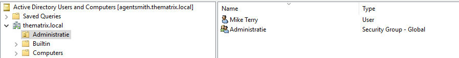

### Configureren van de Group Policies

1. Open Powershell ISE als administrator en open DC_Script_GroupPolicies.ps1

2. Verander eventueel de variabelen (lijn 17-19)

   ```powershell
   #Variables
   $noControlPanel = "Block Control Panel for users"
   $noNetworkProperties = "Block Network Adapter properties for users"
   $noGamesLink = "Delete Games Link from startmenu"
   ```

3. Group Policies zijn aangemaakt en toegekend aan de juiste OU's

   

    Op een User binnen Administratie de control panel is niet toegankelijk

   

### Configureren DFS namespace

1. Open Powershell ISE als administrator en open DC_Script_DFS.ps1

2. Verander eventueel de variabelen (lijn 17-19)

   ```powershell
   #Variables
   $shareFolder = "C:\DFSRoots\UserShare "
   $nameFolder = "UserShare"
   $path = "\\agentsmith\UserShare"
   ```

3. Een DFS Namespace is aangemaakt op de domeincontroller.


## Configuratie

Als u al deze configuratie kan uitvoeren (zoals geïllustreerd in de screenshots) dan is de webserver volledig geconfigureerd en operationeel.

1. Pas alvorens het beginnen van de configuratie de variabelen USERNAME en PASSWORD aan naar uw persoonlijke perferencies. (u kan dit doen bovenaan het configuratiescript trinity.sh)

   

2. Start vervolgens de webserver op door het trinity.sh bestand uit te voeren in de vagrant omgeving.
   

3. Als het script volledig is uitgevoerd (zoals hieronder geïllustreerd) dan is de webserver volledig geconfigureerd.
   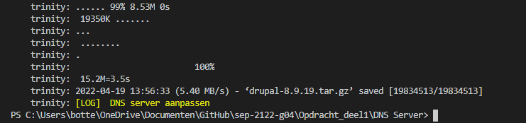


Zoek https://172.16.128.52 om te controleren als de webserver te bereiken is via een webbrowser naar keuze op een wekstation binnen het netwerk.


1. Selecteer de taal English om de configuratie verder te doen


2. Selecteer de standard versie

   

3. Vul de volgende gegevens in

   

4. vul uw gegevens in 

   

5. Als u deze pagina berijkt hebt dan is de webserver volledig operationeel en geconfigureerd

   

   


## Configuratie Domein Controller voor Exchange 2019

### Voorbereiding Domeincontroller voor Microsoft Exchange installatie

1. Download Exchange 2019 en .NET 4.8 (download links staan in het script) op de domeincontroller

2. Verander eventueel de variabelen (lijn 22-23)

```powershell
# Variables
$ExchangeInstallationMedia = "F:"
$DotNetInstallationMedia = "C:\ndp48-x86-x64-allos-enu.exe"
```

3. Run het DC_Script_Prerequisites.ps1 script

4. Indien er gewerkt wordt binnen 1 netwerk via een bridged adapter is het aangeraden om te werken met verschillende Admin accounts.
   Run daarom de onderste lijnen van het script DC_Script_Users.ps1 uit.

```powershell
# Creating MDT and Exchange Admin accounts
New-ADUser -Name "EchangeAdmin" -SamAccountName "ExchangeAdmin" -AccountPassword $securepassword -PasswordNeverExpires:$true -ChangePasswordAtLogon $false -Enabled $true
Add-ADGroupMember -Identity "Administrators" -Members "ExchangeAdmin"
Add-ADGroupMember -Identity "Domain Admins" -Members "ExchangeAdmin"
```


## Configuratie Email Server

### Aanmaken van een Windows Server 2019 machine in Oracle VM Virtualbox

1. Maak in Oracle VM Virtualbox een nieuwe VM aan met de volgende eigenschappen:

   -  2 harde schijven van elk 50gb
   -  NAT adapter en host-only adapter (verbonden met de dns server en domeincontroller)
   -  8192mb RAM
   -  2 cpu's

2. Installeer Windows Server 2019 desktop experience op de virtuele machine

3. Installeer de Virtualbox Guest Additions op de virtuele machine

### Email Server neo basisconfiguratie

Opmerking! Zorg dat u altijd bent ingelogd als domein administrator (THEMATRIX\Administrator of THEMATRIX\EchangeAdmin)

1. Run het neo_Script_Configuration.ps1 script

2. Verander eventueel de variabelen (lijn 18-24)

```powershell
# Parameters
$ComputerName = "neo"
$Adapter = "Ethernet"
$Adapter2 = "Ethernet 2"
$IP_Adress = "172.16.128.53"
$NetMask = "28"
$DefaultGateway = "172.16.128.49"
$DNSServer = "172.16.128.51"
```

3. De computernaam is veranderd naar neo. De 2 netwerkadapters (WAN en LAN) zien er als volgt uit: 


### Email Server toevoegen aan het domein

1. Run het neo_Script_JoinDomain.ps1 script

2. Neo is toegevoegd aan het domein thematrix.local


### Voorbereiding neo voor Microsoft xchange installatie

1. Download .NET 4.8, Visual C++ Redistributable Packages en Unified Communications Managed API 4.0 Runtime (download links staan in het script)

2. Open het neo_Script_ExchangePreparation.ps1 script en verander eventueel de variabelen (lijnen 24-27)

```powershell
# Variables
$DotNetInstallationMedia = "C:\ndp48-x86-x64-allos-enu.exe"
$C2013x64InstallationMedia = "C:\vcredist_x64.exe"
$C2013x86InstallationMedia = "C:\vcredist_x86.exe"
$UcmaInstallationMedia = "C:\UcmaRuntimeSetup.exe"
```

3. Run het script

### Installatie Microsoft Exchange 2019

1. Download Microsoft Exchange 2019

2. Open het neo_Script_ExchangeInstall.ps1 script en verander eventueel de variabelen (lijn 21)

```powershell
#Variables
$ExchangeInstallationMedia = "E:"
```

3. Run het script, uitvoer: 


### Configuratie Microsoft Exchange 2019

1. Run het neo_Script_ExchangeInstall.ps1 script
2. Exchange is nu volledig geconfigureerd


## Configuratie Domein Controller agentsmith als voorbereiding op MDT Server

1. Indien er gewerkt wordt binnen 1 netwerk via een bridged adapter is het aangeraden om te werken met verschillende Admin accounts.
   Run daarom de onderste lijnen van het script DC_Script_Users.ps1 uit.

```powershell
# Creating MDT and Exchange Admin accounts
New-ADUser -Name "MDTAdmin" -SamAccountName "MDTAdmin" -AccountPassword $securepassword -PasswordNeverExpires:$true -ChangePasswordAtLogon $false -Enabled $true
Add-ADGroupMember -Identity "Administrators" -Members "MDTAdmin"
Add-ADGroupMember -Identity "Domain Admins" -Members "MDTAdmin"
```

2. Run het DC_Script_Prerequisites.ps1 script

3. De domeincontroller is nu klaar om samen te werken met de MDT Server

### (Optioneel) Configureren van DHCP op de domeincontroller

1. Indien er niet gewerkt wordt met een router diend de domeincontroller geconfigureerd te worden als een router

2. Ga in de Server Manager en voeg de rol DHCP en Remote Access (duid routing aan) toe.

3. Ga in de Server Manager naar tools en kies Routing and Remote Access. 

4. Configureer LAN aan de hand van de NAT Adapter. Zo is er internet verbinding mogelijk op de clients via DHCP.

5. Configureer voor DHCP een nieuwe Scope met range 172.16.128.56 - 172.16.128.62 en volgende rules: 


6. Authorize de Server binnen DHCP.

## Configuratie MDT Server

Auteur(s): Joris D'haen en Gilles De Praeter

## Configuratie Domein Controller agentsmith

### Voorbereiding Active Directory

1. Indien er gewerkt wordt binnen 1 netwerk via een bridged adapter is het aangeraden om te werken met verschillende Admin accounts.
   Run daarom de onderste lijnen van het script DC_Script_Users.ps1 uit.

```powershell
# Creating MDT and Exchange Admin accounts
New-ADUser -Name "MDTAdmin" -SamAccountName "MDTAdmin" -AccountPassword $securepassword -PasswordNeverExpires:$true -ChangePasswordAtLogon $false -Enabled $true
Add-ADGroupMember -Identity "Administrators" -Members "MDTAdmin"
Add-ADGroupMember -Identity "Domain Admins" -Members "MDTAdmin"
```

2. Run het DC_Script_Prerequisites.ps1 script

3. De domeincontroller is nu klaar om samen te werken met de MDT Server

### (Optioneel) Configureren van DHCP op de domeincontroller

1. Indien er niet gewerkt wordt met een router dient de domeincontroller geconfigureerd te worden als een router

2. Ga in de Server Manager en voeg de rol DHCP en Remote Access (duid routing aan) toe.

3. Ga in de Server Manager naar tools en kies Routing and Remote Access. 

4. Configureer LAN aan de hand van de NAT Adapter. Zo is er internet verbinding mogelijk op de clients via DHCP.

5. Configureer voor DHCP een nieuwe Scope met range 172.16.128.56 - 172.16.128.62 en volgende rules: 


6. Authorize de Server binnen DHCP.

### Aanmaken van een Windows Server 2019 machine in Oracle VM Virtualbox

1. Maak in Oracle VM Virtualbox een nieuwe VM aan met de volgende eigenschappen:

   - 2 harde schijven van elk 50gb
   - NAT adapter en host-only adapter (verbonden met de dns server en domeincontroller)
   - Minimum 4096mb RAM
   - 2 cpu's

2. Installeer Windows Server 2019 desktop experience op de virtuele machine

3. Installeer de Virtualbox Guest Additions op de virtuele machine

4. Initialiseer de tweede hdd op de vm via disk management.

### MDT Server theoracle basisconfiguratie

Opmerking! Zorg dat u altijd bent ingelogd als domein administrator (THEMATRIX\Administrator of THEMATRIX\MDTAdmin) 

1. Run het theoracle_script_configuration.ps1 script

2. Verander eventueel de variabelen (lijn 18-24)

```powershell
# Parameters
$ComputerName = "theoracle"
$Adapter = "Ethernet"
$Adapter2 = "Ethernet 2"
$IP_Adress = "172.16.128.54"
$NetMask = "28"
$DefaultGateway = "172.16.128.49"
$DNSServer = "172.16.128.51"
```

3. De computernaam is veranderd naar theoracle. De 2 netwerkadapters (WAN en LAN) zijn aangepast naar de waarden in het script. 

### MDT Server toevoegen aan het domein

1. Run het theoracle_script_join_domain.ps1 script

2. theoracle is toegevoegd aan het domein thematrix.local

### MDT Server voorbereiden voor Microsoft Deployment Toolkit

1. Run het theoracle_script_MDT_Prerequisites.ps1 script.

2. Dit script download en installeert alle software nodig voor MDT.

### Microsoft Deployment Toolkit downloaden

1. Run het theoracle_script_MDT_Download.ps1 script.

2. Dit script download de nieuwste versie van Microsoft Deployment Toolkit

### Microsoft Deployment Toolkit installeren

1. Run het theoracle_Script_MDT_Install.ps1 script.

2. Dit script installeert Microsoft Deployment Toolkit.

### Microsoft Deployment Toolkit configureren

1. Run het theoracle_script_MDT_Configuration.ps1 script 

2. Dit script configureerd volgende zaken binnen MDT: 

```powershell
# This script:            - Creates shared logs folder
#                         - Creates Deployment Shared folder
#                         - Creates OS Folder in MDT for both Workstation and Windows Server
#                         - Creates Task Sequence folders for both Workstation and Windows Server
#                         - Creates Applications folder
#                         - Imports Applications in the Applications folder for both Workstation and Windows Server
#                         - Imports OS files for both Workstation and Windows Server
#                         - Modifies CustomSettings.ini file
#                         - Modifies Bootstrap.ini file 
```

3. Voor de volgende zaken volg je de Technische Documentatie. 
4. Na het volgen van de Technische Documentatie is het uitrollen van een client of server compleet.


## Configuratie domeincontroller

### Installeren en configureren rol Remote Access

1. Ga in de Server Manager en installeer de rol Remote Access (incl. Routing)

2. Configureer bij Routing and Remote Access LAN Routing aan de hand van de NAT Adapter


3. Nu is routing mogelijk via DHCP zodat de clients internetverbinding hebben

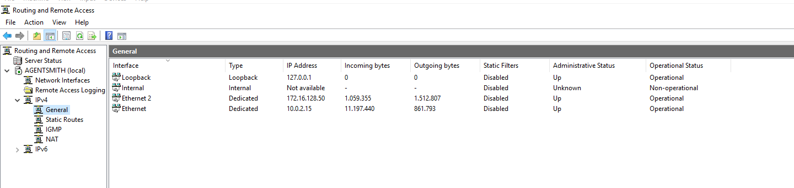

### Installeren en configureren rol DHCP

1. Ga in de Server Manager en installeer de rol DHCP

2. Configureer een nieuwe Scope met range 

3. Configureer voor DHCP een nieuwe Scope met range 172.16.128.56 - 172.16.128.62 en volgende rules: 

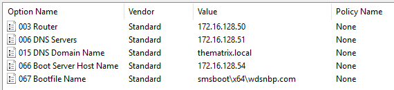

6. Authorize de Server binnen DHCP.

## Configuratie MDT Server theoracle

### Importeren Windows 10 en Windows Server 2019 ISO's

Download de Windows 10 client en Windows Server 2019 ISO's. Mount de iso en kopieer al de content naar de juiste folder. 

Voor Windows 10 x64 `C:\Source\Operating Systems\Windows 10 X64\1903` 

Voor Windows Server 2019 `C:\Source\Operating Systems\Windows Server\2019`

### Aanmaken Task Sequences

#### Task Sequence Werkstation

Na het uitvoeren van het `theoracle_script_MDT_Configuration.ps1` worden volgende folders aangemaakt binnen de Deployment Workbench

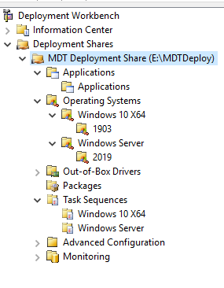

Voor het aanmaken van de Task Sequence voor de werkstations rechtermuisklik op de Windows 10 x64 folder onder Task Sequences, en geef volgende waarden mee in de New Task Sequence Wizard

* Task sequence ID: W10-X64-001
* Task sequence name: Windows 10 Enterprise x64 Custom Image
* Task sequence comments: Werkstation Image
* Template: Standard Client Task Sequence
* Select OS: Windows 10 Enterprise x64 in 1903 install.wim
* Specify Product Key: Do not specify a product key at this time
* Full Name: thematrix
* Organization: thematrix.local
* Internet Explorer home page: http://thematrix.local
* Admin Password: Do not specify an Administrator Password at this time


#### Task Sequence Server

Voor het aanmaken van de Task Sequence voor de Server rechtermuisklik op de Windows Server folder onder Task Sequences, en geef volgende waarden mee in de New Task Sequence Wizard

* Task sequence ID: WS2019-001
* Task sequence name: Windows Server 2019 SERVERSTANDARD Custom Image
* Task sequence comments: Windows Server Image
* Template: Standard Client Task Sequence
* Select OS: Windows Server 2019 SERVERSTANDARD in 2019 install.wim
* Specify Product Key: Do not specify a product key at this time
* Full Name: thematrix
* Organization: thematrix.local
* Internet Explorer home page: http://thematrix.local
* Admin Password: Do not specify an Administrator Password at this time


### Deploy de deployment share

Binnen de Deployment Workbench rechtermuisklik op de deployment share en kies `Update Deployment Share` en volg de standaard wizard.

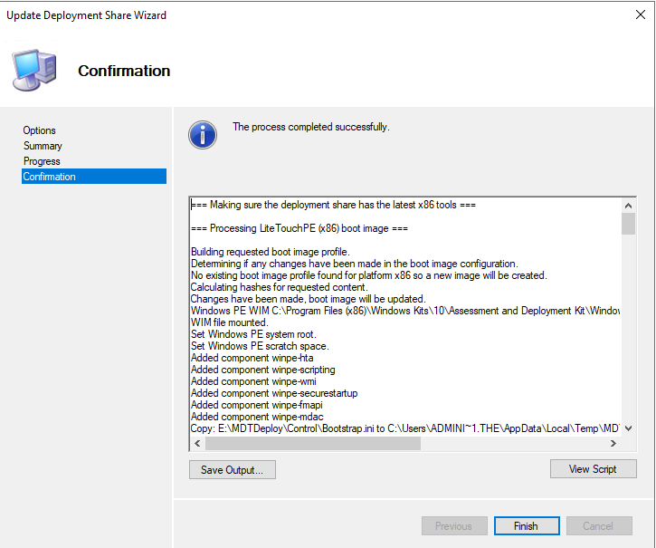

### Configuratie Windows Deployment Services

Ga in de Server Manager naar Tools en dan Windows Deployment Services 

Ga naar de server en kies configure server met volgende opties

* Integrated with Active Directory
* Path: `E:\RemoteInstall`
* Respond to all client computers (known and unknown)

Ga naar de Boot Images en voeg de boot image toe die we net hebben gecreërd in `E:\MDTDeploy\Boot\Lite_Touchx64`.

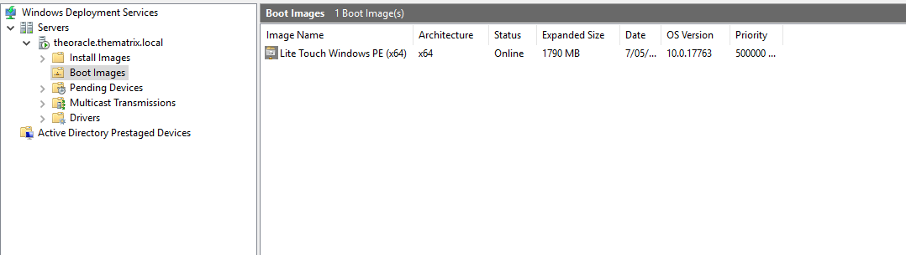

Om de PXE-boot juist te laten verlopen rechterklik op de Server in de tool Windows DeploymentServices. Onder het TFTP tabblad vinken we Enable Variable Window Extension uit en zorg dat de maximum block size op 1500 staat.

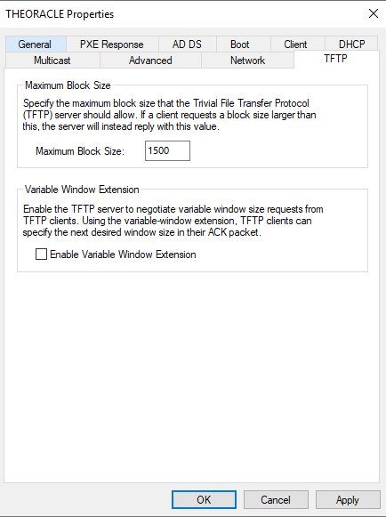

### Finale aanpassingen

Ga naar WDS, dan naar properties van de server en dan naar boot en pas het volgende aan:

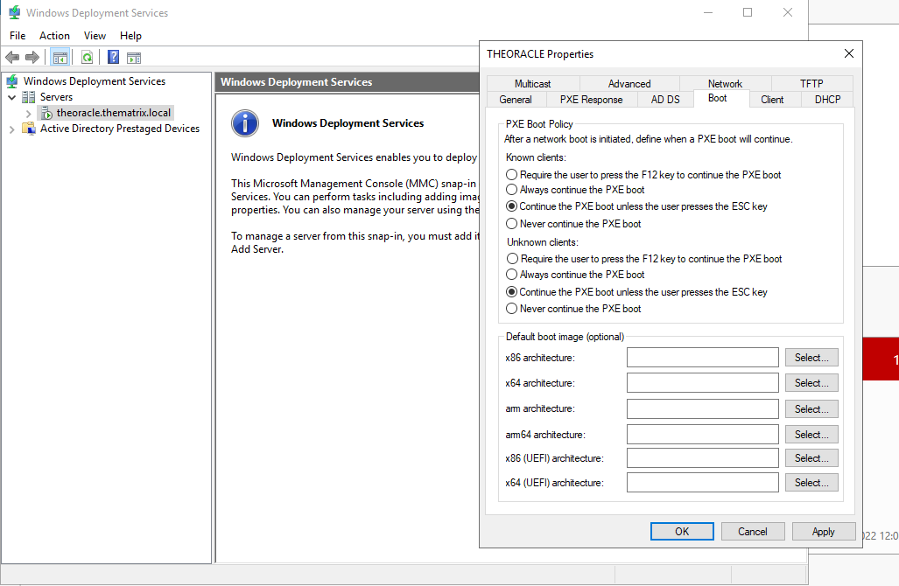

Ga naar control panel, network and internet, network and sharing center, advanced sharing settings en pas het volgende aan:


Ga naar credential manager, add a windows credential en vul het volgende in (domain\admin user + password):

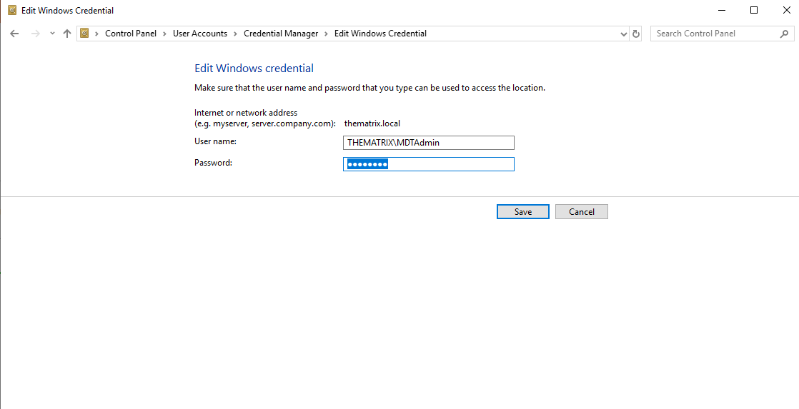

### Deployen Windows Image

Maak een nieuwe VM aan binnen Virtualbox en zorg ervoor dat de netwerk adapter een bridged adapter is zodat communicatie binnen het netwerk mogelijk is.

Controleer de boot order zodat deze er als volgt uitziet:


Boot dan de VM. Het MDT proces gaat nu van start. 

De client krijgt een ip adres en internet verbinding via DHCP.

Volg de wizard tot het uitrollen van de client compleet is.

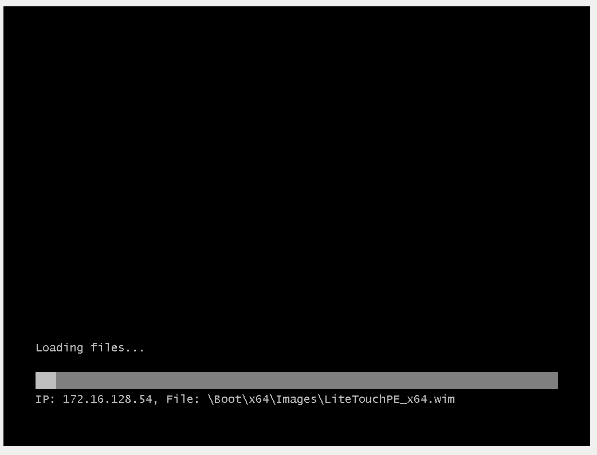 


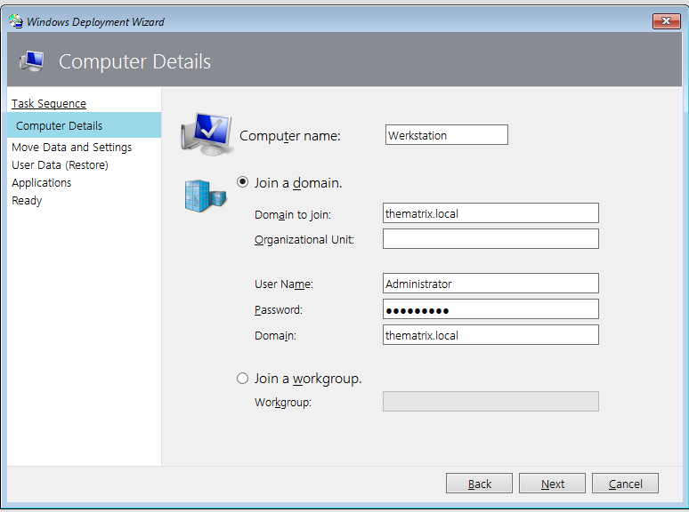 

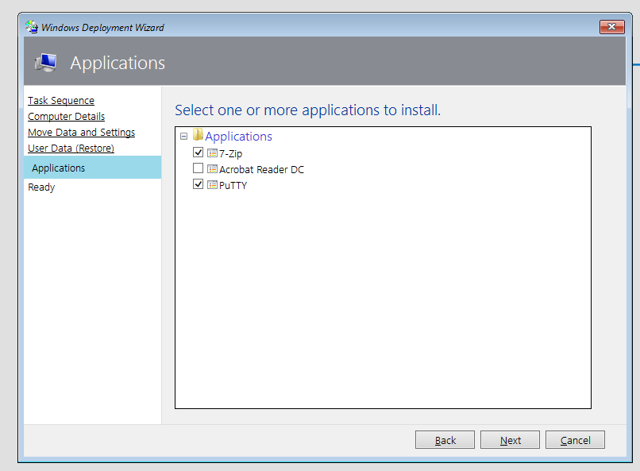 

