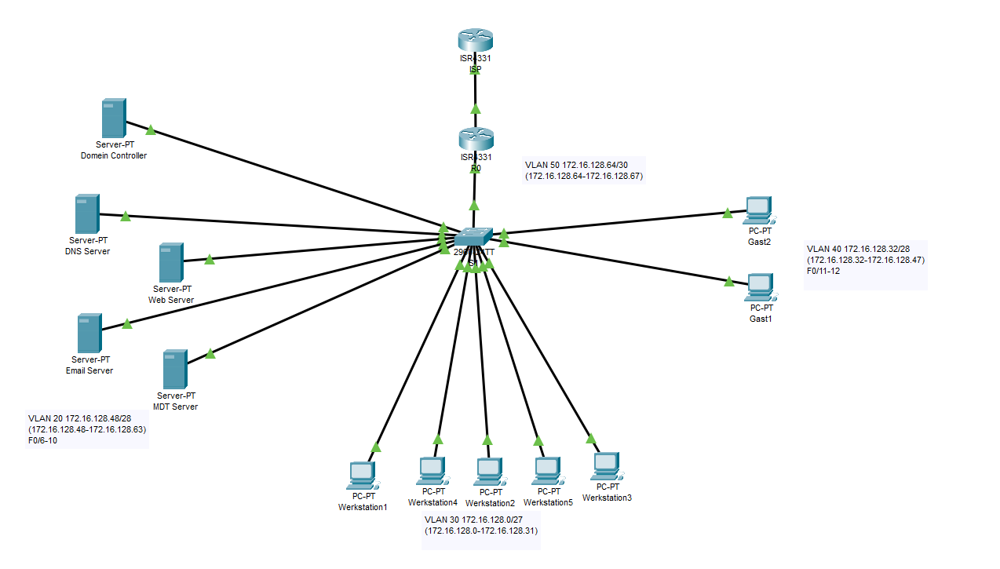
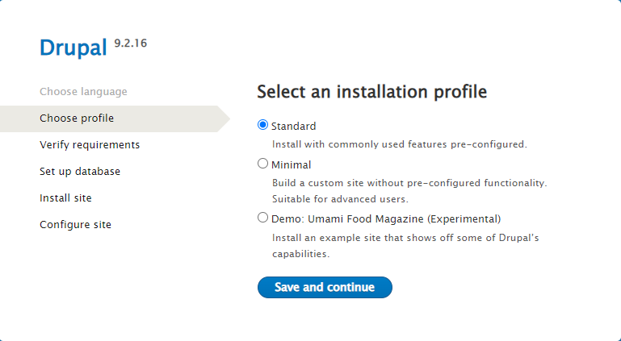
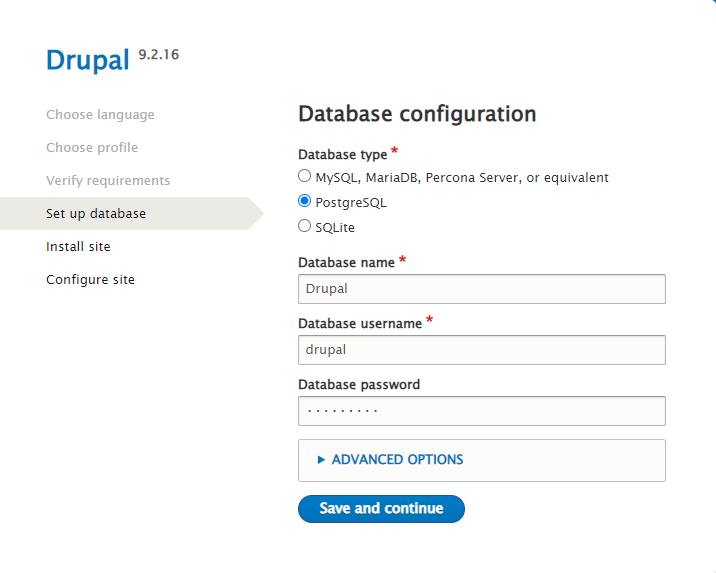
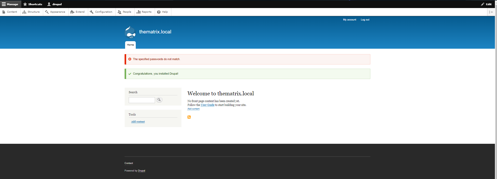
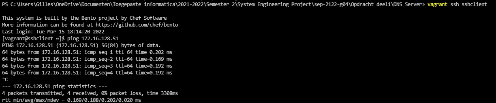

# Configuratie Netwerk

## Topologie




## Ip Adrestabel 

Vlan 20 (14 hosts: 172.16.128.48/28 - 172.16.128.63/28 )

| Machine     | IP-adres      | Subnetmask      | IPV6-adres (enkel voor dns) |
| ----------- | ------------- | --------------- | --------------------------- |
| Agent Smith | 172.16.128.50 | 255.255.255.240 | 2001:DB8:ACAD:A::1/64       |
| Morpheus    | 172.16.128.51 | 255.255.255.240 | 2001:DB8:ACAD:A::2/64       |
| Trinity     | 172.16.128.52 | 255.255.255.240 | 2001:DB8:ACAD:A::3/64       |
| Neo         | 172.16.128.53 | 255.255.255.240 | 2001:DB8:ACAD:A::4/64       |
| The oracle  | 172.16.128.54 | 255.255.255.240 | 2001:DB8:ACAD:A::5/64       |
| SSH client  | 172.16.128.55 | 255.255.255.240 | 2001:DB8:ACAD:A::6/64       |
| ...         | ...           | ...             | ...                         |
| .           | 172.16.128.62 | 255.255.255.240 | 2001:DB8:ACAD:A::13/64      |


Vlan 30 (30 hosts: 172.16.128.0/27 - 172.16.128.31/28 )

| Machine        | IP-adres      | Subnetmask      |
| -------------- | ------------- | --------------- |
| R0/0/0.30      | 172.16.128.1  | 255.255.255.224 |
| Werkstation 1  | 172.16.128.2  | 255.255.255.224 |
| Werkstation 2  | 172.16.128.3  | 255.255.255.224 |
| Werkstation 3  | 172.16.128.4  | 255.255.255.224 |
| Werkstation 4  | 172.16.128.5  | 255.255.255.224 |
| ...            | ...           | ...             |
| Werkstation 30 | 172.16.128.30 | 255.255.255.224 |

Vlan 40 (14 hosts: 172.16.128.32/28 - 172.16.128.47/28 )

| Machine | IP-adres      | Subnetmask      |
| ------- | ------------- | --------------- |
| Gast 1  | 172.16.128.33 | 255.255.255.240 |
| Gast 2  | 172.16.128.34 | 255.255.255.240 |
| Gast 3  | 172.16.128.35 | 255.255.255.240 |
| Gast 4  | 172.16.128.36 | 255.255.255.240 |
| ...     | ...           | ...             |
| Gast 16 | 172.16.128.46 | 255.255.255.240 |

Vlan 50 (niet van toepassing)

## ConfiguratieVolgorde

1. Opzetten fysieke topologie = (Nathan en Gilles) 
2. Bekabeling op de tafel (Jorris en Jarne)
3. Configuratie router en switch (Nathan)
4. Opzetten dns server en webserver (Gilles)
5. Testen netwerk door middel van ping
6. Opzetten AD Domeincontroller (Jorris)
7. Opzetten Email server (Jarne)
8. Opzetten MDTserver (Gilles)
9. Opzetten MDTclient (Nathan)
10. Testen bereikbaarheid webserver, email server vanop de mdt client


## Configuratie Topologie

Opm:

- int g0/0/0 is voor lan, g0/0/1 is voor buiten

## Configuratie

### Configuratie S1 VLAN

* ```Switch(config)#hostname S1```
* ```S1(config)#no ip domain-lookup```
* ```S1(config)#banner motd " Je moet ut mn schuvn bluvn! "```
* ```S1(config)#vlan 20```
* ```S1(config-vlan)#name LANSERVERS```
* ```S1(config-vlan)#vlan 30```
* ```S1(config-vlan)#name LANWORKSTATIONS```
* ```S1(config-vlan)#vlan 40```
* ```S1(config-vlan)#name LANGUESTS```
* ```S1(config-vlan)#exit```
* ```S1(config)#int range F0/6-10```
* ```S1(config-if-range)#switchport mode access```
* ```S1(config-if-range)#switchport access vlan 20```
* ```S1(config-if-range)#no shut```
* ```S1(config-if-range)#exit```
* ```S1(config)#int range f0/1-5```
* ```S1(config-if-range)#switchport mode access ```
* ```S1(config-if-range)#switchport access vlan 30```
* ```S1(config-if-range)#no shut```
* ```S1(config-if-range)#exit```
* ```S1(config)#int range f0/11-12```
* ```S1(config-if-range)#switchport mode access```
* ```S1(config-if-range)#switchport access vlan 40```
* ```S1(config-if-range)#exit```
* ```S1(config)#int g0/1```
* ```S1(config-if)#switchport mode trunk ```
* ```S1(config-if)#no shut```
* ```S1(config-if)#exit```


### Configuratie R1 Router-on-a-stick

* ```Router(config)#hostname R1```
* ```R1(config)#no ip domain-lookup```
* ```R1(config)#banner motd " Je moet ut mn schuvn bluvn! "```
* ```R1(config)#int g0/0/0```
* ```R1(config-if)#no shut```
* ```R1(config-if)#int g0/0/0.20```
* ```R1(config-subif)#description VLANSERVERS```
* ```R1(config-subif)#encapsulation dot1Q 20```
* ```R1(config-subif)#ip address 172.16.128.49 255.255.255.240```
* ```R1(config-subif)#exit```
* ```R1(config)#int g0/0/0.30```
* ```R1(config-subif)#description VLANWORKSTATIONS```
* ```R1(config-subif)#encapsulation dot1Q 30```
* ```R1(config-subif)#ip address 172.16.128.1 255.255.255.224```
* ```R1(config-subif)#exit```
* ```R1(config)#int g0/0/0.40```
* ```R1(config-subif)#description VLANGUESTS```
* ```R1(config-subif)#encapsulation dot1Q 40```
* ```R1(config-subif)#ip address 172.16.128.33 255.255.255.240```
* ```R1(config-subif)#exit```
* ```R1(config)#ip route 0.0.0.0 0.0.0.0 g0/0/1```

### Configuratie ISP router

Enkel voor packet tracer, fysiek: kabel van Router naar tafel en daar doorverbinden naar poort [0-5] en deze config overslaan

* ```Switch(config)#hostname ISP```
* ```ISP(config)#int loopback 1```
* ```ISP(config-if)#ip address 10.0.0.10 255.255.255.0```
* ```ISP(config-if)#exit```
* ```ISP(config)#ip route 0.0.0.0 0.0.0.0 loopback 1```
* ```ISP(config)#int g0/0/1```
* ```ISP(config-if)#ip address 10.0.1.1 255.255.255.0```
* ```ISP(config-if)#no shut```
* ```ISP(config)#ip dhcp excluded-address 10.0.1.1```
* ```ISP(config)#ip dhcp pool HOGENT```
* ```ISP(dhcp-config)#network 10.0.1.0 255.255.255.0```
* ```ISP(dhcp-config)#default-router 10.0.1.1```
* ```ISP(dhcp-config)#exit```

### Configuratie R1 dhcp

* ```R1(config)#int g0/0/1```
* ```R1(config-if)#ip address dhcp```
* ```R1(config-if)#no shut```
* ```R1(config)#ip dhcp excluded-address 172.16.128.49 172.16.128.62```
* ```R1(config)#ip dhcp pool POOL-WORKSTATIONS```
* ```R1(dhcp-config)#network 172.16.128.0 255.255.255.224```
* ```R1(dhcp-config)#default-router 172.16.128.1```
* ```R1(dhcp-config)#dns-server 172.16.128.51```
* ```R1(dhcp-config)#option 66 ip 172.16.128.54```
* ```R1(dhcp-config)#option 67 ascii Boot\x64\wdsnbp.com```
* ```int g0/0/0.30 ```
* ```ip helper-address 172.16.128.54 ```
* ```R1(dhcp-config)#exit```
* ```R1(config)#ip dhcp pool POOL-GUESTS```
* ```R1(dhcp-config)#network 172.16.128.32 255.255.255.240```
* ```R1(dhcp-config)#default-router 172.16.128.33```
* ```R1(dhcp-config)#dns-server 172.16.128.51```
* ```R1(dhcp-config)#exit```


### Configuratie R1 NAT

* ```R1(config)#access-list 1 permit 172.16.128.48 0.0.0.15```
* ```R1(config)#access-list 1 permit 172.16.128.0 0.0.0.31```
* ```R1(config)#access-list 1 permit 172.16.128.32 0.0.0.15```
* ```R1(config)#ip nat inside source list 1 interface g0/0/1 overload```
* ```R1(config)#int g0/0/0```
* ```R1(config-if)#ip nat inside``` 
* ```R1(config-if)#int g0/0/1```
* ```R1(config-if)#ip nat outside```
* ```R1(config)#int g0/0/0.20```
* ```R1(config-subif)#ip nat inside```
* ```R1(config-subif)#int g0/0/0.30```
* ```R1(config-subif)#ip nat inside```
* ```R1(config-subif)#int g0/0/0.40```
* ```R1(config-subif)#ip nat inside```


### ACL VLAN40

* ```R1(config)#ip access-list extended GUEST-ACL```
* ```R1(config-ext-nacl)#permit udp any any eq domain```
* ```R1(config-ext-nacl)#permit tcp any any eq domain```
* ```R1(config-ext-nacl)#deny ip 172.16.128.32 0.0.0.15 172.16.128.48 0.0.0.15```
* ```R1(config-ext-nacl)#deny ip 172.16.128.32 0.0.0.15 172.16.128.0 0.0.0.31```
* ```R1(config-ext-nacl)#permit ip any any```
* ```R1(config)#int g0/0/0.40```
* ```R1(config-subif)#ip access-group GUEST-ACL in```


## Dns

1. Voer het configuratiebestand (morpheus.sh) uit via vagrant.

   

   ! Zorg wel dat het configuratiebestand uitgevoerd word in de juist directory waar de Vagrantfile zit

   Als het bestand correct uitgevoerd is dan moet de uitvoer er zo uitzien:

   

## trinity aanzetten

1. Pas alvorens het beginnen van de configuratie de variabelen USERNAME en PASSWORD aan naar uw persoonlijke perferencies. (u kan dit doen bovenaan het configuratiescript trinity.sh)

   

2. Start vervolgens de webserver op door het trinity.sh bestand uit te voeren in de vagrant omgeving.
   

3. Als het script volledig is uitgevoerd Zoek https://thematrix.local of https://www.thematrix.local op  om te controleren als de webserver te bereiken is via een webbrowser naar keuze op een wekstation binnen het netwerk.

Als u al deze configuratie kan uitvoeren (zoals geïllustreerd in de screenshots) dan is de webserver volledig geconfigureerd en operationeel.


Zoek https://172.16.128.52 om te controleren als de webserver te bereiken is via een webbrowser naar keuze op een wekstation binnen het netwerk.


1. Selecteer de taal English om de configuratie verder te doen


2. Selecteer de standard versie

   

3. Vul de volgende gegevens in

   

4. vul uw gegevens in 

   

5. Als u deze pagina berijkt hebt dan is de webserver volledig operationeel en geconfigureerd

   


## sshclient aanzetten (via sshclient kunt ge in trinity en morpheus)
 Een apparaat uit het netwerk moet kunnen pingen naar de dns server. We starten dus de sshclient op. Hierbij controleren we ook direct of de public ssh key van de sshclient aan morpheus is toegevoegd

- Start de VM sshclient op net zoals we hierboven gedaan hebben met morpheus:

  

- De sshclient is goed opgestart als je het volgende op het scherm ziet:

  

- Nu gaan we ssh'en in de sshclient en gaan we pingen naar morpheus (ping 172.16.128.51):

  

- Nu kan je volgend commando uitvoeren om te ssh'en in morpheus -> ssh 172.16.128.51

  - Vergeet niet "yes" in te typen op de vraag "Are you sure you want to continue connecting (yes/no/[fingerprint])?"
  - als alles goed gaat moet het scherm er zo uitzien:

  

- We zitten dus via SSH momenteel in de morpheus VM. Nu gaan we kijken of de key toegevoegd is aan het bestand "authorized_keys" aan de hand van dit commando "cat .ssh/authorized_keys". Het moet volgende output geven:

  


nu gaan we ssh'en naar de sshclient en moet de ssh server op 'trinity' nog manueel herstart worden. dit kan via volgend commando's: 

   * vagrant ssh sshclient
   * ssh 172.16.128.52 (vervolgens yes intypen)
   * sudo systemctl restart sshd
   * exit
     

6. Nu controleren we of je nog met de root kan inloggen of bijvoorbeeld een andere gebruiker 'drupal' vanaf sshclient naar trinity. Dit zou niet mogen werken!
   * ssh root@172.16.128.52
   * ssh drupal@172.16.128.52
     

7. Als laatste bevestigen we nog even of we met de public key kunnen inloggen door het commando: ssh 172.16.128.52
   


## Domeincontroller aanzetten

Zet de Domeincontroller (AgentSmith) aan door op start te drukken in virtual box en in te loggen binnen het thematrix netwerk.


## email server aanzetten

Zet de email server (Neo) aan door op start te drukken in virtual box en in te loggen binnen het thematrix netwerk


Eens

## mdt aanzetten

Zet de email MDTServer(TheOracle) aan door op start te drukken in virtual box en in te loggen binnen het thematrix netwerk

## windows client via mdt aanzetten (nieuwe vm op apart pc)

### Deployen Windows Image

Maak een nieuwe VM aan binnen Virtualbox en zorg ervoor dat de netwerk adapter een bridged adapter is zodat communicatie binnen het netwerk mogelijk is.

Controleer de boot order zodat deze er als volgt uitziet: OK


Boot dan de VM. Het MDT proces gaat nu van start. 

De client krijgt een ip adres en internet verbinding via DHCP.

Volg de wizard tot het uitrollen van de client compleet is. OK


Als laatste heb ik ook nog eens getest of de email server werkt vanaf de MDT server. Ik heb me in de browser van de workstation ingelogd en een mail van Mike Terry naar Clyde Braiden gestuurt. Dit werkte zoals verwacht!


De mdt client moet ook in staat zijn om de webserver te bereiken op het addres https://thematrix.local of https://www.thematrix.local

   