# Technische documentatie MDT Server theoracle

## Configuratie domeincontroller

### Installeren en configureren rol Remote Access

1. Ga in de Server Manager en installeer de rol Remote Access (incl. Routing)

2. Configureer bij Routing and Remote Access LAN Routing aan de hand van de NAT Adapter

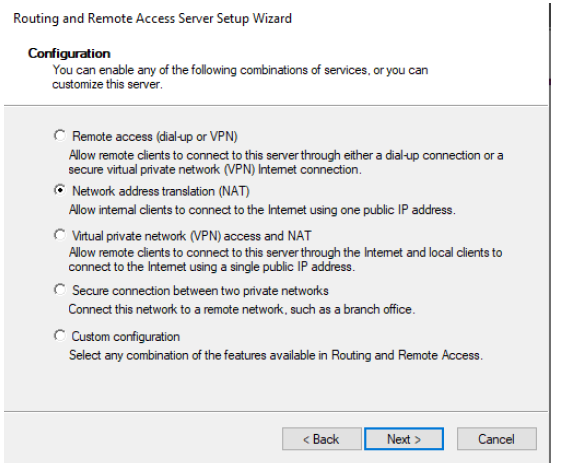

3. Nu is routing mogelijk via DHCP zodat de clients internetverbinding hebben

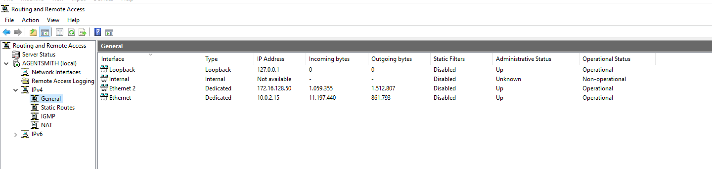

### Installeren en configureren rol DHCP

1. Ga in de Server Manager en installeer de rol DHCP

2. Configureer een nieuwe Scope met range 

5. Configureer voor DHCP een nieuwe Scope met range 172.16.128.56 - 172.16.128.62 en volgende rules: 

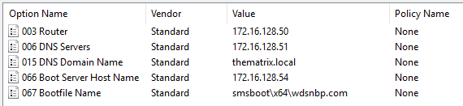

6. Authorize de Server binnen DHCP.

## Configuratie MDT Server theoracle

### Importeren Windows 10 en Windows Server 2019 ISO's

Download de Windows 10 client en Windows Server 2019 ISO's. Mount de iso en kopieer al de content naar de juiste folder. 

Voor Windows 10 x64 `C:\Source\Operating Systems\Windows 10 X64\1903` 

Voor Windows Server 2019 `C:\Source\Operating Systems\Windows Server\2019`

### Aanmaken Task Sequences
#### Task Sequence Werkstation
Na het uitvoeren van het `theoracle_script_MDT_Configuration.ps1` worden volgende folders aangemaakt binnen de Deployment Workbench

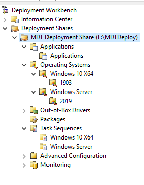

Voor het aanmaken van de Task Sequence voor de werkstations rechtermuisklik op de Windows 10 x64 folder onder Task Sequences, en geef volgende waarden mee in de New Task Sequence Wizard

* Task sequence ID: W10-X64-001
* Task sequence name: Windows 10 Enterprise x64 Custom Image
* Task sequence comments: Werkstation Image
* Template: Standard Client Task Sequence
* Select OS: Windows 10 Enterprise x64 in 1903 install.wim
* Specify Product Key: Do not specify a product key at this time
* Full Name: thematrix
* Organization: thematrix.local
* Internet Explorer home page: http://thematrix.local
* Admin Password: Do not specify an Administrator Password at this time

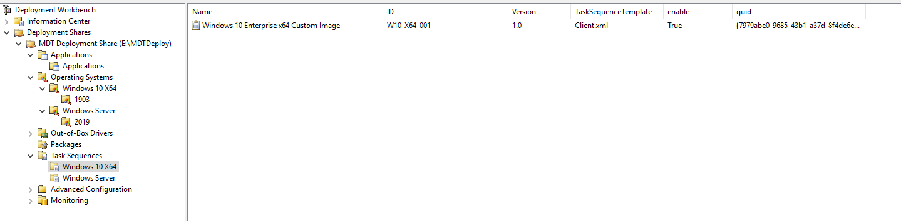

#### Task Sequence Server

Voor het aanmaken van de Task Sequence voor de Server rechtermuisklik op de Windows Server folder onder Task Sequences, en geef volgende waarden mee in de New Task Sequence Wizard

* Task sequence ID: WS2019-001
* Task sequence name: Windows Server 2019 SERVERSTANDARD Custom Image
* Task sequence comments: Windows Server Image
* Template: Standard Client Task Sequence
* Select OS: Windows Server 2019 SERVERSTANDARD in 2019 install.wim
* Specify Product Key: Do not specify a product key at this time
* Full Name: thematrix
* Organization: thematrix.local
* Internet Explorer home page: http://thematrix.local
* Admin Password: Do not specify an Administrator Password at this time

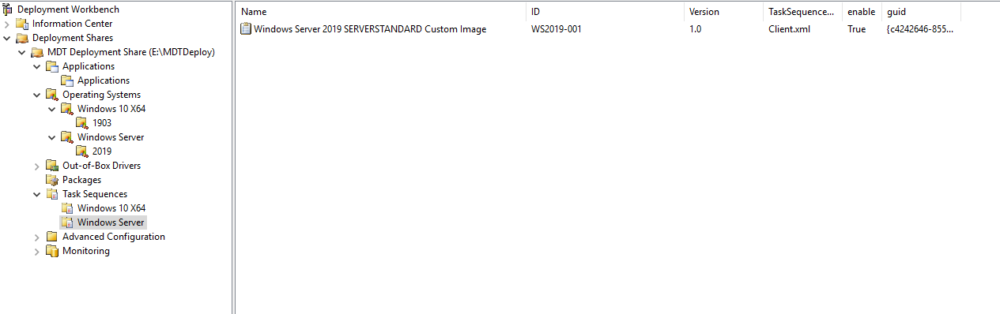

### Deploy de deployment share

Binnen de Deployment Workbench rechtermuisklik op de deployment share en kies `Update Deployment Share` en volg de standaard wizard.

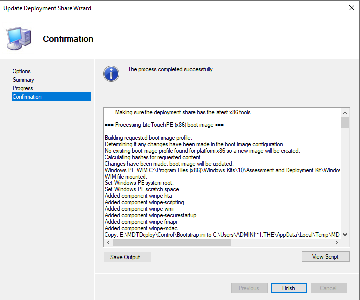

### Configuratie Windows Deployment Services

Ga in de Server Manager naar Tools en dan Windows Deployment Services 

Ga naar de server en kies configure server met volgende opties
 
* Integrated with Active Directory
* Path: `E:\RemoteInstall`
* Respond to all client computers (known and unknown)

Ga naar de Boot Images en voeg de boot image toe die we net hebben gecreërd in `E:\MDTDeploy\Boot\Lite_Touchx64`.

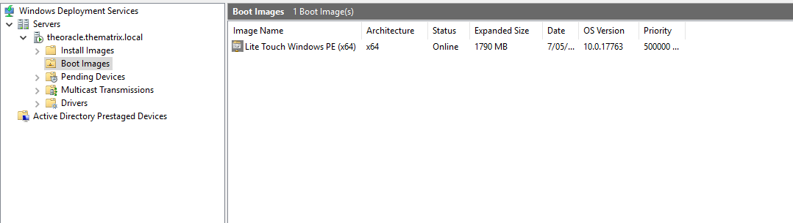

Om de PXE-boot juist te laten verlopen rechterklik op de Server in de tool Windows DeploymentServices. Onder het TFTP tabblad vinken we Enable Variable Window Extension uit en zorg dat de maximum block size op 1500 staat.

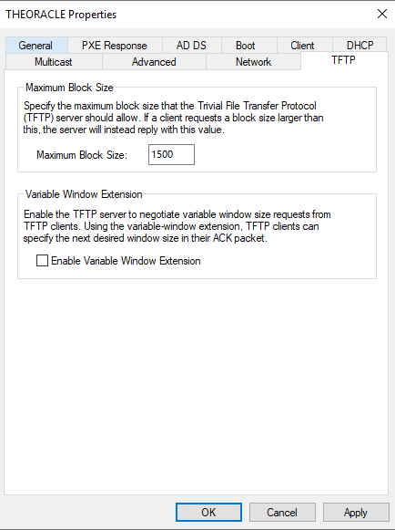

### Finale aanpassingen

Ga naar WDS, dan naar properties van de server en dan naar boot en pas het volgende aan:

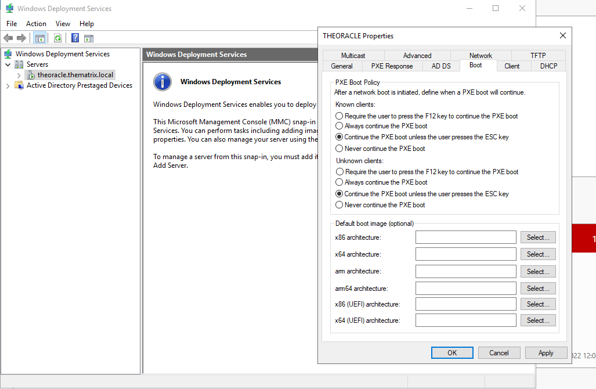

Ga naar control panel, network and internet, network and sharing center, advanced sharing settings en pas het volgende aan:

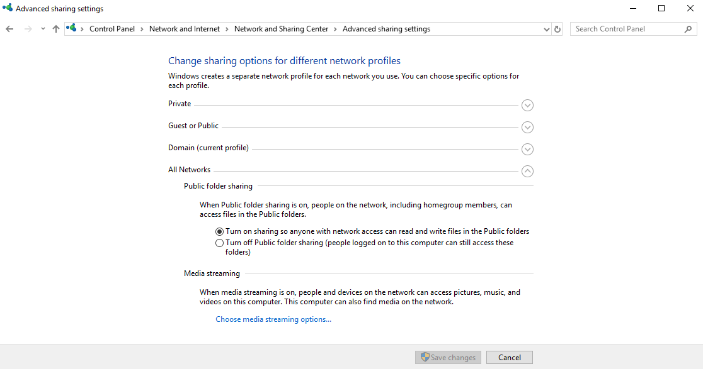

Ga naar credential manager, add a windows credential en vul het volgende in (domain\admin user + password):

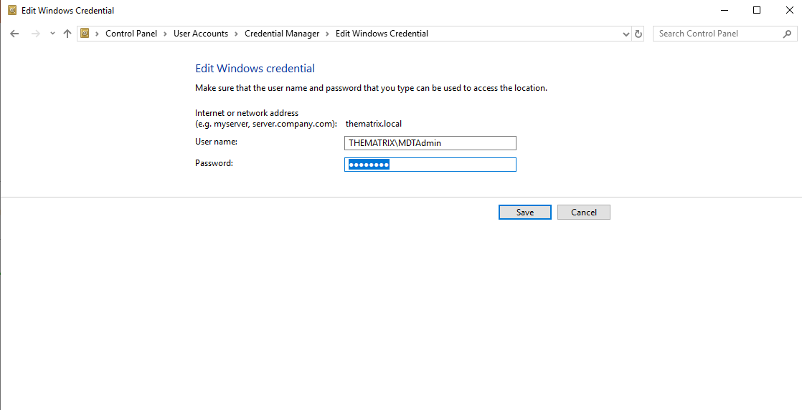

### Deployen Windows Image

Maak een nieuwe VM aan binnen Virtualbox en zorg ervoor dat de netwerk adapter een bridged adapter is zodat communicatie binnen het netwerk mogelijk is.

Controleer de boot order zodat deze er als volgt uitziet:

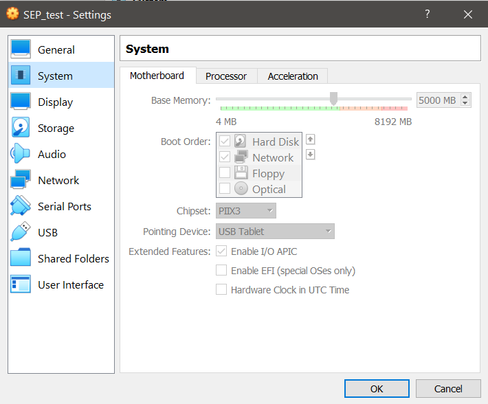

Boot dan de VM. Het MDT proces gaat nu van start. 

De client krijgt een ip adres en internet verbinding via DHCP.

Volg de wizard tot het uitrollen van de client compleet is.

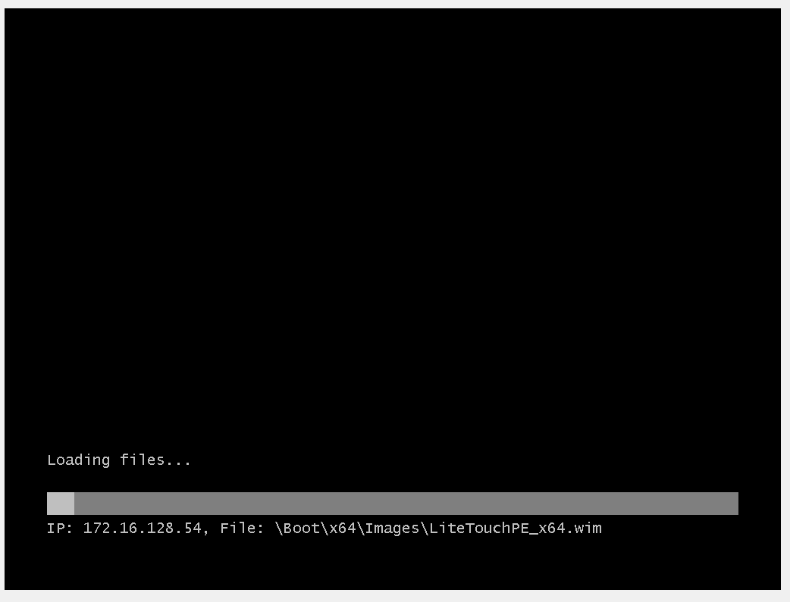 

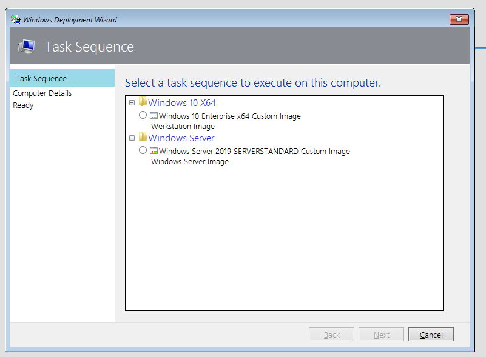

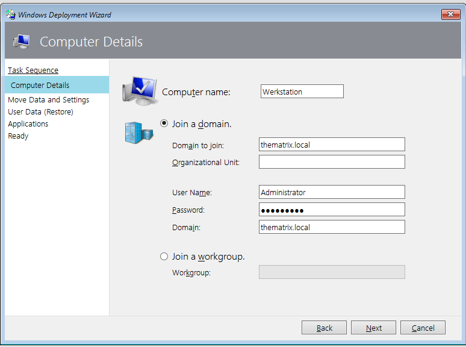 

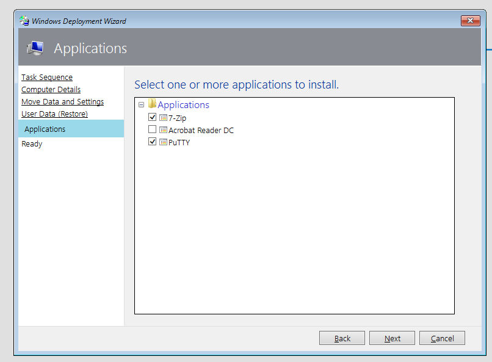 

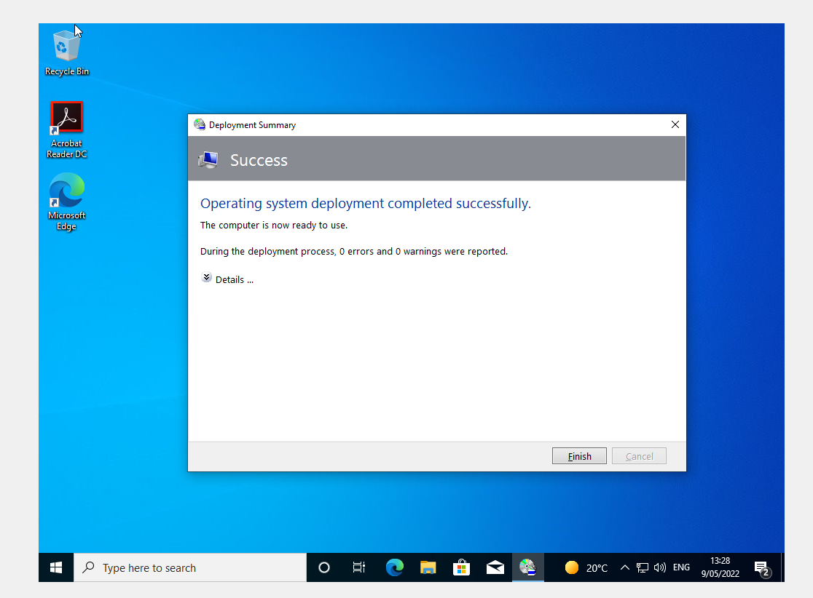 
