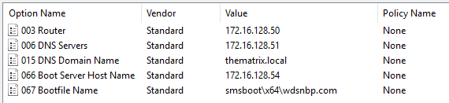

# Testplan: MDT Server theoracle

Auteur(s) testplan: Joris D'haen

## Configuratie Domein Controller agentsmith

### Voorbereiding Active Directory

1. Indien er gewerkt wordt binnen 1 netwerk via een bridged adapter is het aangeraden om te werken met verschillende Admin accounts.
    Run daarom de onderste lijnen van het script DC_Script_Users.ps1 uit.

```powershell
# Creating MDT and Exchange Admin accounts
New-ADUser -Name "MDTAdmin" -SamAccountName "MDTAdmin" -AccountPassword $securepassword -PasswordNeverExpires:$true -ChangePasswordAtLogon $false -Enabled $true
Add-ADGroupMember -Identity "Administrators" -Members "MDTAdmin"
Add-ADGroupMember -Identity "Domain Admins" -Members "MDTAdmin"
```

2. Run het DC_Script_Prerequisites.ps1 script

3. De domeincontroller is nu klaar om samen te werken met de MDT Server

### (Optioneel) Configureren van DHCP op de domeincontroller

1. Indien er niet gewerkt wordt met een router dient de domeincontroller geconfigureerd te worden als een router

2. Ga in de Server Manager en voeg de rol DHCP en Remote Access (duid routing aan) toe.

3. Ga in de Server Manager naar tools en kies Routing and Remote Access. 

4. Configureer LAN aan de hand van de NAT Adapter. Zo is er internet verbinding mogelijk op de clients via DHCP.

5. Configureer voor DHCP een nieuwe Scope met range 172.16.128.56 - 172.16.128.62 en volgende rules: 



6. Authorize de Server binnen DHCP.

## Configuratie MDT Server

### Aanmaken van een Windows Server 2019 machine in Oracle VM Virtualbox

1. Maak in Oracle VM Virtualbox een nieuwe VM aan met de volgende eigenschappen:

    - 2 harde schijven van elk 50gb
    - NAT adapter en host-only adapter (verbonden met de dns server en domeincontroller)
    - Minimum 4096mb RAM
    - 2 cpu's

2. Installeer Windows Server 2019 desktop experience op de virtuele machine

3. Installeer de Virtualbox Guest Additions op de virtuele machine

4. Initialiseer de tweede hdd op de vm via disk management.

### MDT Server theoracle basisconfiguratie

Opmerking! Zorg dat u altijd bent ingelogd als domein administrator (THEMATRIX\Administrator of THEMATRIX\MDTAdmin) 

1. Run het theoracle_script_configuration.ps1 script

2. Verander eventueel de variabelen (lijn 18-24)
```powershell
# Parameters
$ComputerName = "theoracle"
$Adapter = "Ethernet"
$Adapter2 = "Ethernet 2"
$IP_Adress = "172.16.128.54"
$NetMask = "28"
$DefaultGateway = "172.16.128.49"
$DNSServer = "172.16.128.51"
```

3. De computernaam is veranderd naar theoracle. De 2 netwerkadapters (WAN en LAN) zijn aangepast naar de waarden in het script. 

### MDT Server toevoegen aan het domein
1. Run het theoracle_script_join_domain.ps1 script

2. theoracle is toegevoegd aan het domein thematrix.local

### MDT Server voorbereiden voor Microsoft Deployment Toolkit

1. Run het theoracle_script_MDT_Prerequisites.ps1 script.

2. Dit script download en installeert alle software nodig voor MDT.

### Microsoft Deployment Toolkit downloaden

1. Run het theoracle_script_MDT_Download.ps1 script.

2. Dit script download de nieuwste versie van Microsoft Deployment Toolkit

### Microsoft Deployment Toolkit installeren

1. Run het theoracle_Script_MDT_Install.ps1 script.

2. Dit script installeert Microsoft Deployment Toolkit.

### Microsoft Deployment Toolkit configureren

1. Run het theoracle_script_MDT_Configuration.ps1 script 

2. Dit script configureerd volgende zaken binnen MDT: 
```powershell
# This script:            - Creates shared logs folder
#                         - Creates Deployment Shared folder
#                         - Creates OS Folder in MDT for both Workstation and Windows Server
#                         - Creates Task Sequence folders for both Workstation and Windows Server
#                         - Creates Applications folder
#                         - Imports Applications in the Applications folder for both Workstation and Windows Server
#                         - Imports OS files for both Workstation and Windows Server
#                         - Modifies CustomSettings.ini file
#                         - Modifies Bootstrap.ini file 
```

3. Voor de volgende zaken volg je de Technische Documentatie. 

4. Na het volgen van de Technische Documentatie is het uitrollen van een client of server compleet.