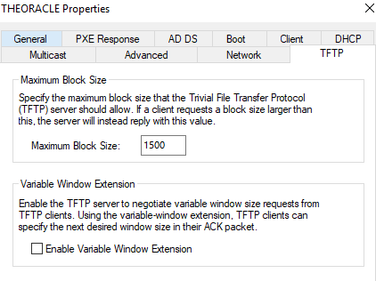

# Testrapport Opdracht MDT

(Een testrapport is het verslag van de uitvoering van het testplan door een teamlid (iemand anders dan de auteur van het testplan!). Deze noteert bij elke stap in het testplan of het bekomen resultaat overeenstemt met wat verwacht werd. Indien niet, dan is het belangrijk om gedetailleerd op te geven wat er misloopt, wat het effectieve resultaat was, welke foutboodschappen gegenereerd werden, enz. De tester kan meteen een Github issue aanmaken en er vanuit het testrapport naar verwijzen. Wanneer het probleem opgelost werdt, wordt een nieuwe test uitgevoerd, met een nieuw verslag.)

## Test 1

Uitvoerder(s) test: Gilles De Praeter
Uitgevoerd op: 10/05/2022 + 20/05/2022
Github commit: ea775763d5db8674dd511525e00d1722b1d39abb

1. Indien er gewerkt wordt binnen 1 netwerk via een bridged adapter is het aangeraden om te werken met verschillende Admin accounts.
   Run daarom de onderste lijnen van het script DC_Script_Users.ps1 uit. OK

   

2. Run het DC_Script_Prerequisites.ps1 script OK

   

## Configuratie MDT Server

### Aanmaken van een Windows Server 2019 machine in Oracle VM Virtualbox

1. Maak in Oracle VM Virtualbox een nieuwe VM aan met de volgende eigenschappen:

   - 2 harde schijven van elk 50gb
   - NAT adapter en host-only adapter (verbonden met de dns server en domeincontroller)
   - Minimum 4096mb RAM
   - 2 cpu's

   OK

   

2. Installeer Windows Server 2019 desktop experience op de virtuele machine OK

3. Installeer de Virtualbox Guest Additions op de virtuele machine OK

   

4. Initialiseer de tweede hdd op de vm via disk management. OK

   

### MDT Server theoracle basisconfiguratie

Opmerking! Zorg dat u altijd bent ingelogd als domein administrator (THEMATRIX\Administrator of THEMATRIX\MDTAdmin)

1. Run het theoracle_script_configuration.ps1 script OK

2. Verander eventueel de variabelen (lijn 18-24) OK

```powershell
# Parameters
$ComputerName = "theoracle"
$Adapter = "Ethernet"
$Adapter2 = "Ethernet 2"
$IP_Adress = "172.16.128.54"
$NetMask = "28"
$DefaultGateway = "172.16.128.49"
$DNSServer = "172.16.128.51"
```

3. De computernaam is veranderd naar theoracle. De 2 netwerkadapters (WAN en LAN) zijn aangepast naar de waarden in het script. OK

   

   

### MDT Server toevoegen aan het domein

1. Run het theoracle_script_join_domain.ps1 script

2. theoracle is toegevoegd aan het domein thematrix.local OK

   

### MDT Server voorbereiden voor Microsoft Deployment Toolkit

1. Run het theoracle_script_MDT_Prerequisites.ps1 script.

2. Dit script download en installeert alle software nodig voor MDT. OK

   

### Microsoft Deployment Toolkit downloaden

1. Run het theoracle_script_MDT_Download.ps1 script.

2. Dit script download de nieuwste versie van Microsoft Deployment Toolkit OK

   

### Microsoft Deployment Toolkit installeren

1. Run het theoracle_Script_MDT_Install.ps1 script.

2. Dit script installeert Microsoft Deployment Toolkit. OK

   

### Microsoft Deployment Toolkit configureren

1. Run het theoracle_script_MDT_Configuration.ps1 script OK

   

2. Dit script configureerd volgende zaken binnen MDT:

```powershell
# This script:            - Creates shared logs folder
#                         - Creates Deployment Shared folder
#                         - Creates OS Folder in MDT for both Workstation and Windows Server
#                         - Creates Task Sequence folders for both Workstation and Windows Server
#                         - Creates Applications folder
#                         - Imports Applications in the Applications folder for both Workstation and Windows Server
#                         - Imports OS files for both Workstation and Windows Server
#                         - Modifies CustomSettings.ini file
#                         - Modifies Bootstrap.ini file
```

3. Voor de volgende zaken volg je de Technische Documentatie.

# Testrapport deel 2:

# Technische documentatie MDT Server theoracle

## Configuratie MDT Server theoracle

### Importeren Windows 10 en Windows Server 2019 ISO's

Download de Windows 10 client en Windows Server 2019 ISO's. Mount de iso en kopieer al de content naar de juiste folder. 

Voor Windows 10 x64 `C:\Source\Operating Systems\Windows 10 X64\1903` 

Voor Windows Server 2019 `C:\Source\Operating Systems\Windows Server\2019`

### Aanmaken Task Sequences
#### Task Sequence Werkstation
Na het uitvoeren van het `theoracle_script_MDT_Configuration.ps1` worden volgende folders aangemaakt binnen de Deployment Workbench OK


OK


#### Task Sequence Server

OK


### Deploy de deployment share

Binnen de Deployment Workbench rechtermuisklik op de deployment share en kies `Update Deployment Share` en volg de standaard wizard. OK


### Configuratie Windows Deployment Services

Ga in de Server Manager naar Tools en dan Windows Deployment Services 

Ga naar de server en kies configure server met volgende opties

Ga naar de Boot Images en voeg de boot image toe die we net hebben gecreërd in `E:\MDTDeploy\Boot\Lite_Touchx64`.

OK


Om de PXE-boot juist te laten verlopen rechterklik op de Server in de tool Windows DeploymentServices. Onder het TFTP tabblad vinken we Enable Variable Window Extension uit en zorg dat de maximum block size op 1500 staat. OK



### Finale aanpassingen

Ga naar WDS, dan naar properties van de server en dan naar boot en pas het volgende aan: OK


Ga naar control panel, network and internet, network and sharing center, advanced sharing settings en pas het volgende aan: OK


Ga naar credential manager, add a windows credential en vul het volgende in (domain\admin user + password): OK


### Deployen Windows Image

Maak een nieuwe VM aan binnen Virtualbox en zorg ervoor dat de netwerk adapter een bridged adapter is zodat communicatie binnen het netwerk mogelijk is.

Controleer de boot order zodat deze er als volgt uitziet: OK


Boot dan de VM. Het MDT proces gaat nu van start. 

De client krijgt een ip adres en internet verbinding via DHCP.

Volg de wizard tot het uitrollen van de client compleet is. OK


Als laatste heb ik ook nog eens getest of de email server werkt vanaf de MDT server. Ik heb me in de browser van de workstation ingelogd en een mail van Mike Terry naar Clyde Braiden gestuurt. Dit werkte zoals verwacht!

