# Testplan: DNS-server bash script Linux

Auteur(s) testplan: Jarne Bottelberghe, Gilles De Praeter

## Configuratie

De tester moet in staat zijn om de dns server online te kunnen stellen zonder enige input van de tester.

Als u al deze testen correct kan uitvoeren (zoals geïllustreerd in de screenshots) dan is de dns server volledig geconfigureerd en operationeel.

1. Voer het configuratiebestand (morpheus.sh) uit via vagrant.

   

   ! Zorg wel dat het configuratiebestand uitgevoerd word in de juist directory waar de Vagrantfile zit

   Als het bestand correct uitgevoerd is dan moet de uitvoer er zo uitzien:

   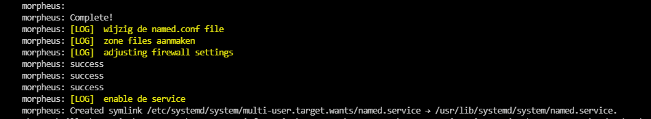

2. Verbind na het runnen van het script met de dns server via ssh en controleer of de named service actief is via het commando "service named status".

   

## Testing

3. Aan de hand van het volgend commando kan u testen of onze bind configuration file klopt. Dit commando mag geen output geven anders is dns niet goed geconfigureerd.

- sudo named-checkconf /etc/named.conf

  

4. Nu gaan we alle zone files gaan controleren. Dit kan aan de hand van de volgende commando's:

- sudo named-checkzone thematrix.local /var/named/forward.thematrix.local
- sudo named-checkzone 128.16.172.in-addr.arpa /var/named/reverseIPv4.thematrix.local
- sudo named-checkzone a.0.0.0.d.a.c.a.8.b.d.0.1.0.0.2.ip6.arpa. /var/named/reverseIPv6.thematrix.local

  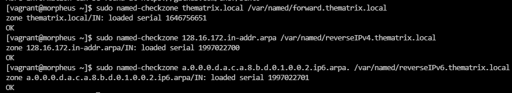
  ​

5. Een apparaat uit het netwerk moet kunnen pingen naar de dns server. We starten dus de sshclient op. Hierbij controleren we ook direct of de public ssh key van de sshclient aan morpheus is toegevoegd

- Start de VM sshclient op net zoals we hierboven gedaan hebben met morpheus:

  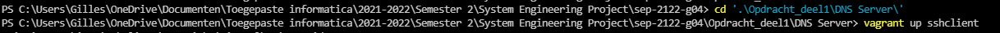

- De sshclient is goed opgestart als je het volgende op het scherm ziet:

  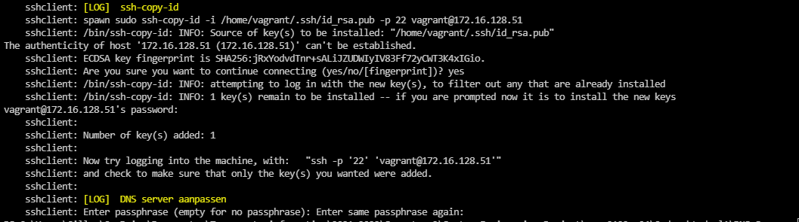

- Nu gaan we ssh'en in de sshclient en gaan we pingen naar morpheus (ping 172.16.128.51):

  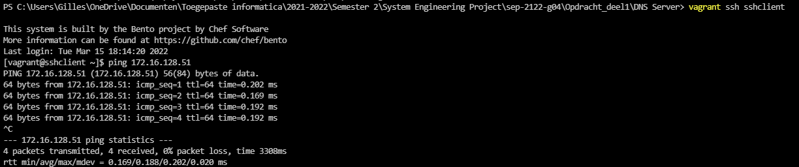

- Nu kan je volgend commando uitvoeren om te ssh'en in morpheus -> ssh 172.16.128.51

  - Vergeet niet "yes" in te typen op de vraag "Are you sure you want to continue connecting (yes/no/[fingerprint])?"
  - als alles goed gaat moet het scherm er zo uitzien:

  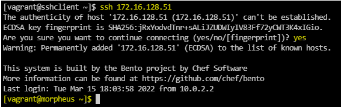

- We zitten dus via SSH momenteel in de morpheus VM. Nu gaan we kijken of de key toegevoegd is aan het bestand "authorized_keys" aan de hand van dit commando "cat .ssh/authorized_keys". Het moet volgende output geven:

  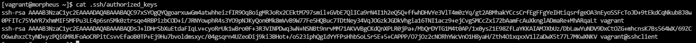

6. Om verder te gaan met het testen gaan we de SSH connectie met Morpheus verbreken zodat we terug op de sshclient zijn. Dit doen we via het commando "exit":

   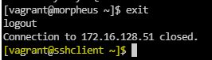

7. Probeer de naam van 1 van de apparaten in het netwerk op te vragen via zijn ip address via het commando host [ip address] (zo testen we de reverse IPv4 lookup zone).

   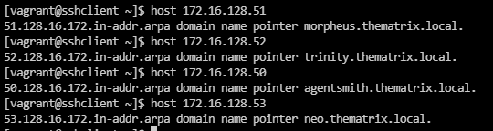

8. Probeer de naam van 1 van de apparaten in het netwerk op te vragen via zijn ipv6 address via het commando host [ip address] (zo testen we de reverse IPv6 lookup zone).

   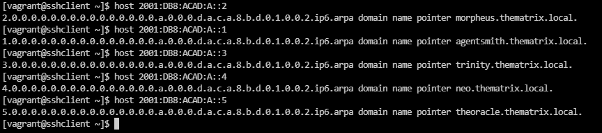

9. Probeer het IP address van 1 van de machines in ons netwerk op te vragen via zijn naam
   (dit kan via het commando nslookup )

   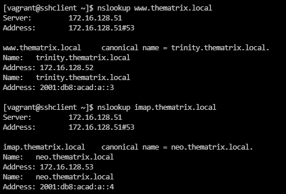

10. Probeer nu als laatste om het IP address van een externe site op te halen. Dit kan weer via nslookup.

- Zoals je kan zien wordt onze DNS server gebruikt, die gebruik maakt van zijn forwarders om de DNS request te forwarden.

  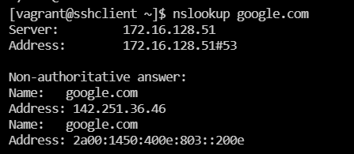
