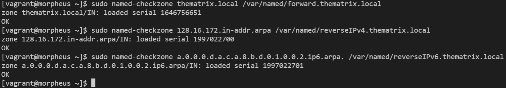
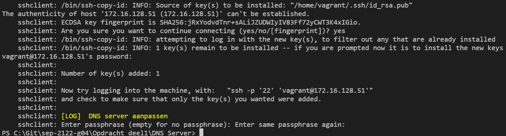

# Testrapport Opdracht 1: DNS-Server bash script Linux

(Een testrapport is het verslag van de uitvoering van het testplan door een teamlid (iemand anders dan de auteur van het testplan!). Deze noteert bij elke stap in het testplan of het bekomen resultaat overeenstemt met wat verwacht werd. Indien niet, dan is het belangrijk om gedetailleerd op te geven wat er misloopt, wat het effectieve resultaat was, welke foutboodschappen gegenereerd werden, enz. De tester kan meteen een Github issue aanmaken en er vanuit het testrapport naar verwijzen. Wanneer het probleem opgelost werdt, wordt een nieuwe test uitgevoerd, met een nieuw verslag.)

## Test 1

Uitvoerder(s) test: Nathan Staelens

Uitgevoerd op: 22/03/2022

Github commit:  ce0eae41abc10810b4e34358ef307c51b8c80fa1

## Test configuratie
1. De morpheus machine aanmaken en configuren met vagrant, commando: ```vagrant up morpheus```

> Uitvoer:

>Verwachte uitvoer

2. Verbinden met morpheus via ssh en controleren of de service named draait, commando: ```vagrant ssh morpheus```

>Uitvoer:

>Verwachte uitvoer

## Testen DNS

1. Configuratiebestand van de service named controleren a.d.h.v. volgend commando: ```sudo named-checkconf /etc/named.conf```

>Uitvoer: 

>Verwachte uitvoer

2. Zone-files controleren met volgende commandos:
   * ```sudo named-checkzone thematrix.local /var/named/forward.thematrix.local```
   * ```sudo named-checkzone 128.16.172.in-addr.arpa /var/named/reverseIPv4.thematrix.local```
   * ```sudo named-checkzone a.0.0.0.d.a.c.a.8.b.d.0.1.0.0.2.ip6.arpa. /var/named/reverseIPv6.thematrix.local```
>Uitvoer:

>Verwachte uitvoer

3. Connectiviteit testen tussen toestellen op het netwerk en de DNS-server

* De ssh-client opstarten a.d.h.v. dit commando: ```vagrant up sshclient```
>Uitvoer:

>Verwachte uitvoer

* Verbinden met de ssh-client via ssh en pingen naar de DNS-server met volgend command: ```vagrant ssh sshclient```, ```ping 172.16.128.51```
>Uitvoer:

>Verwachte uitvoer

* Verbinden met morpheus vanuit ssh-client via ssh, commando: ```ssh 172.16.128.51```
>Uivoer:  

>Verwachte uitvoer

* Controleren of de key van sshclient in de authorized keys van morpheus zit, commando: ```cat .ssh/authorized_keys```
>Uitvoer: 

>Verwachte uitvoer

* De ssh verbinding verbreken met ```exit```
>Uitvoer:

>Verwachte uitvoer

4. DNS controleren

* controleren of we een naam kunnen terugvinden met een IPv4 adres (reverse lookup), commando: ```host 172.16.128.[51-54]```
>Uitvoer:

>Verwachte uitvoer

* controleren of we een naam kunnen terugvinden met een IPv6 adres (reverse lookup), commando: ```host 2001:DB8:ACAD:A::[1-5]```
>Uitvoer:

>Verwachte uitvoer

* IP adres ophalen van een toestel a.d.h.v. de naam, commando: ```nslookup www.thematrix.local```:
>Uitvoer:

>Verwachte uitvoer

* dns lookup van een externe site die niet in de zone files zit, commando:```nslookup www.google.com```:
>Uitvoer:

>Verwachte uitvoer