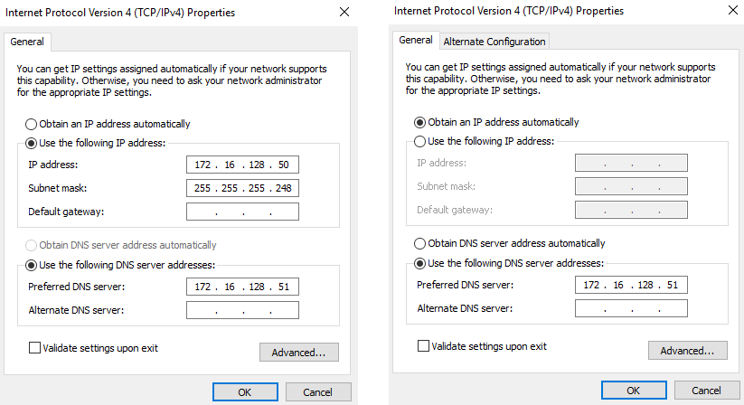
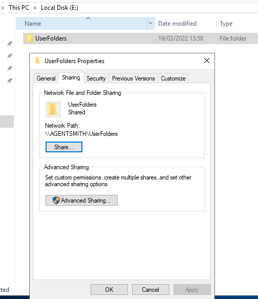
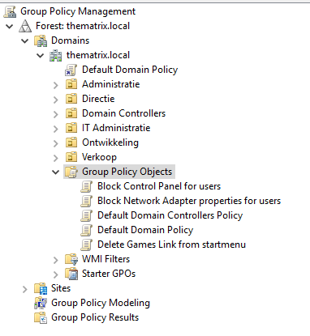
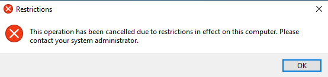

# Testplan: Powershell Scripts Domeincontroller

Auteur(s) testplan: Joris D'haen

## Benodigheden

De tester moet beschikken over Oracle VM Virtualbox, een Windows Server 2019 ISO en een operationele DNS Server (Morpheus) aangesloten op hetzelde netwerk als de domeincontroller

## Configuratie Domeincontroller

### Aanmaken van een Windows Server 2019 machine in Oracle VM Virtualbox

1. Ga in Oracle VM Virtualbox en maak een nieuwe VM aan met de volgende eigenschappen:
    
    
    
    - De Windows Server 2019 ISO
    - Twee SATA ports voor de C: en E: schijf (elk dynamisch en 50gb groot)
    - NAT adapter en een Host-Only Adapter (op hetzelfde netwerk als de DNS Server Morpheus)

2. Installeer Windows Server 2019 desktop experience op de machine

3. Kies een wachtwoord en gebruik agentsmith als hostname

4. Installeer de Virtualbox Guest Additions op de machine

### Server agentsmith basisconfiguratie

1. Open Powershell ISE als administrator en open DC_Script_Configuration.ps1

2. Verander eventueel de variabelen (lijn 18-24)
```powershell
# Parameters
$ComputerName = "agentsmith"
$Adapter = "Ethernet"
$Adapter2 = "Ethernet 2"
$IP_Adress = "172.16.128.50"
$NetMask = "29"
$DefaultGateway = "172.16.128.49"
$DNSServer = "172.16.128.51"
```

3. Voer het script uit. De computernaam is veranderd naar agentsmith. De 2 netwerkadapters (LAN en WAN) zien er als volgt uit
    
   

### Domein thematrix.local aanmaken en server agentsmith promoveren tot een domeincontroller

1. Open Powershell ISE als administrator en open DC_Script_Domain.ps1

2. Verander eventueel de variabelen (lijn 17)
```powershell
# Variables
$domainname="thematrix.local"
```

3. Voer het script uit. Het domein thematrix.local is aangemaakt en agentsmith is de domeincontroller
    
   

### Aanmaken Organizational Units en groepen

1. Open Powershell ISE als administrator en open DC_Script_Groups.ps1, de OU's en groepen worden aangemaakt binnen het domein
   
   

### Aanmaken Shared User Folders

1. Open Powershell ISE als administrator en open DC_Script_Folders.ps1

2. Verander eventueel de variabelen (lijn 17-19)
    ```powershell
    $path = "E:\UserFolders"
    $name = "UserFolders"
    $fullaccess = "thematrix\Domain Users"
    ```
3. De folder is aangemaakt en wordt geshared binnen het domein

    

### Aanmaken Users binnen het domein

1. Open Powershell ISE als administrator en open DC_Script_Users.ps1

2. Voor dit script is een .csv bestand nodig (Users.csv), deze is te vinden in de 'CSV bestanden' folder

3. Verander eventueel de variabelen (lijn 24)
    ```powershell
    # Variables
    $csvpath = "C:\Users.csv"
    ```
    
4. Users zijn toegevoegd binnen het domein in de juiste OU's en groepen
    
    

### Configureren van de Group Policies

1. Open Powershell ISE als administrator en open DC_Script_GroupPolicies.ps1

2. Verander eventueel de variabelen (lijn 17-19)
    ```powershell
    #Variables
    $noControlPanel = "Block Control Panel for users"
    $noNetworkProperties = "Block Network Adapter properties for users"
    $noGamesLink = "Delete Games Link from startmenu"
    ```

3. Group Policies zijn aangemaakt en toegekend aan de juiste OU's

   
    
    Op een User binnen Administratie de control panel is niet toegankelijk
    
   

### Configureren DFS namespace

1. Open Powershell ISE als administrator en open DC_Script_DFS.ps1

2. Verander eventueel de variabelen (lijn 17-19)
    ```powershell
    #Variables
    $shareFolder = "C:\DFSRoots\UserShare "
    $nameFolder = "UserShare"
    $path = "\\agentsmith\UserShare"
    ```

3. Een DFS Namespace is aangemaakt op de domeincontroller.
