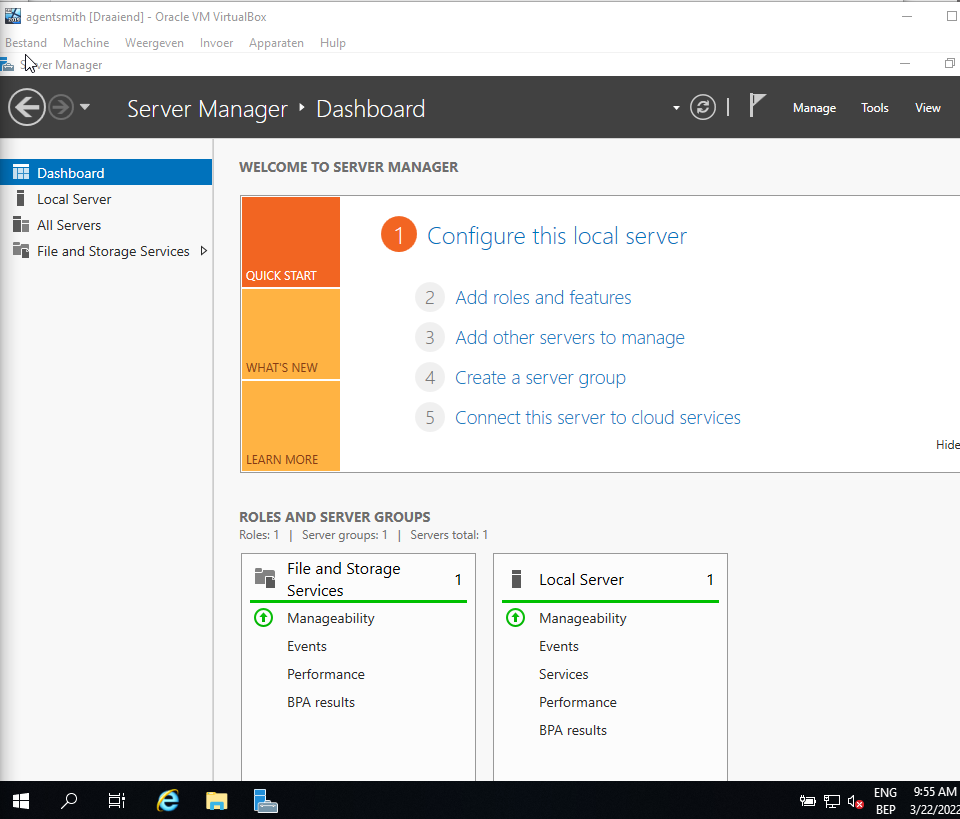
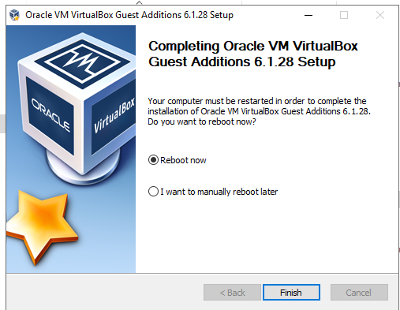
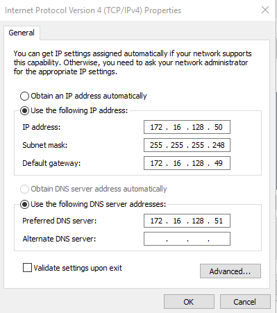
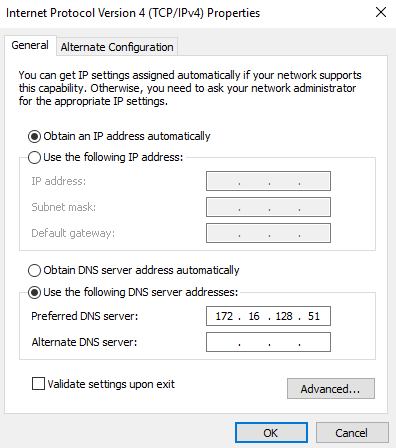
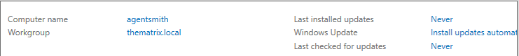
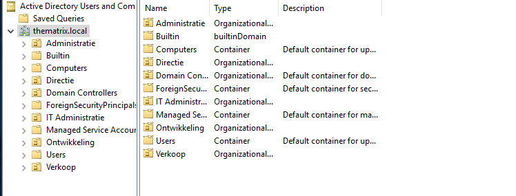
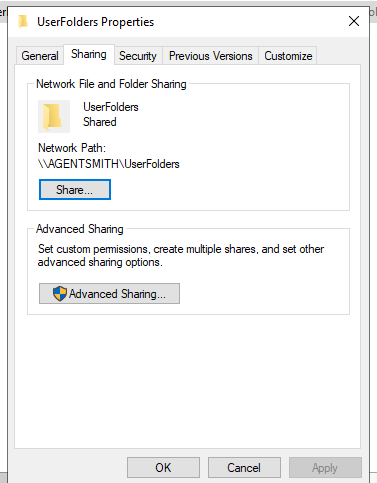
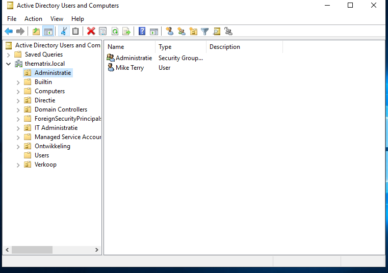
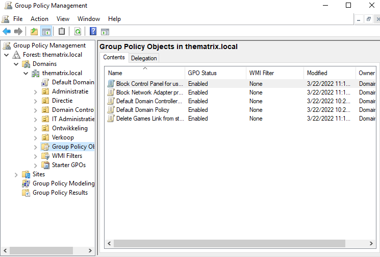
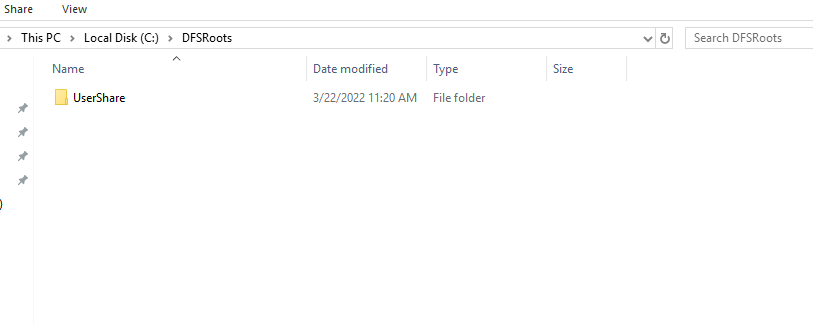

# Testrapport: DomeinController

## Test 1 ()

Uitvoerder(s) test: Jarne Bottelberghe 
Uitgevoerd op: 22/03/2022

## Installatie Windows-Server

Om het testplan te kunnen voltooien moet ik eerst een windows server vm aanmaken volgens de gegeven configuratie. Dit is voor mij foutloos verlopen.

## Server agentsmith basisconfiguratie

Ik kan het configuratie script zonder problemen runnen,na het runnen van het configuratiescript moest ik mijn machine heropstarten. Na het heropstarten kunnen we zien dat het sript gewerkt heeft omdat de hostname en de interfaces zijn aangepast.

 

## Domein aanmaken  en server promoveren

Ik kan het DC_Script_Domain runnen zonder problemen en het domain veranderd na een restart. 

## Aanmaken Organizational Units en groepen

Na het runnen van het script zijn de groepen aangemaakt

## Aanmaken Shared user Folders

Na het runnen van het script is er een gedeelde map aangemaakt die gedeeld word met het netwerk

## Aanmaken users

Na het runnen van het script zijn de users aangemaakt.

## Group policies

Na het runnen van het script zijn de grouppolicies aangemaakt 

## Configureren van DFS namespace

Het script kon ik runnen zonder problemen. Er werd een folder voor dfs aangemaakt op de C schrijf

