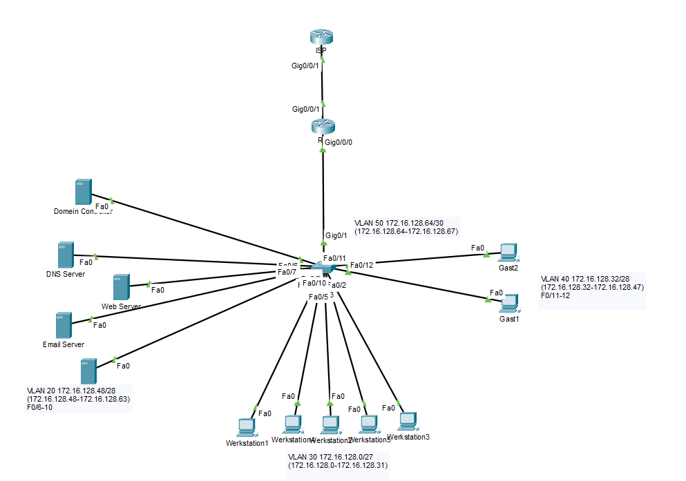

# Configuratieplan netwerk

## Topologie:


Opm:
- int g0/0/0 is voor lan, g0/0/1 is voor buiten

## Configuratie

### Configuratie S1 VLAN

* ```Switch(config)#hostname S1```
* ```S1(config)#no ip domain-lookup```
* ```S1(config)#banner motd " Je moet ut mn schuvn bluvn! "```
* ```S1(config)#vlan 20```
* ```S1(config-vlan)#name LANSERVERS```
* ```S1(config-vlan)#vlan 30```
* ```S1(config-vlan)#name LANWORKSTATIONS```
* ```S1(config-vlan)#vlan 40```
* ```S1(config-vlan)#name LANGUESTS```
* ```S1(config-vlan)#vlan 50```
* ```S1(config-vlan)#name LAN50```
* ```S1(config-vlan)#exit```
* ```S1(config)#int range F0/6-10```
* ```S1(config-if-range)#switchport mode access```
* ```S1(config-if-range)#switchport access vlan 20```
* ```S1(config-if-range)#no shut```
* ```S1(config-if-range)#exit```
* ```S1(config)#int range f0/1-5```
* ```S1(config-if-range)#switchport mode access ```
* ```S1(config-if-range)#switchport access vlan 30```
* ```S1(config-if-range)#no shut```
* ```S1(config-if-range)#exit```
* ```S1(config)#int range f0/11-12```
* ```S1(config-if-range)#switchport mode access```
* ```S1(config-if-range)#switchport access vlan 40```
* ```S1(config-if-range)#exit```
* ```S1(config)#int g0/1```
* ```S1(config-if)#switchport mode trunk ```
* ```S1(config-if)#no shut```
* ```S1(config-if)#exit```


### Configuratie R1 Router-on-a-stick

* ```Router(config)#hostname R1```
* ```R1(config)#no ip domain-lookup```
* ```R1(config)#banner motd " Je moet ut mn schuvn bluvn! "```
* ```R1(config)#int g0/0/0```
* ```R1(config-if)#no shut```
* ```R1(config-if)#int g0/0/0.20```
* ```R1(config-subif)#description VLANSERVERS```
* ```R1(config-subif)#encapsulation dot1Q 20```
* ```R1(config-subif)#ip address 172.16.128.49 255.255.255.240```
* ```R1(config-subif)#exit```
* ```R1(config)#int g0/0/0.30```
* ```R1(config-subif)#description VLANWORKSTATIONS```
* ```R1(config-subif)#encapsulation dot1Q 30```
* ```R1(config-subif)#ip address 172.16.128.1 255.255.255.224```
* ```R1(config-subif)#exit```
* ```R1(config)#int g0/0/0.40```
* ```R1(config-subif)#description VLANGUESTS```
* ```R1(config-subif)#encapsulation dot1Q 40```
* ```R1(config-subif)#ip address 172.16.128.33 255.255.255.240```
* ```R1(config-subif)#exit```
* ```R1(config)#ip route 0.0.0.0 0.0.0.0 g0/0/1```

### Configuratie ISP router

Enkel voor packet tracer, fysiek: kabel van Router naar tafel en daar doorverbinden naar poort [0-5] en deze config overslaan

* ```Switch(config)#hostname ISP```
* ```ISP(config)#int loopback 1```
* ```ISP(config-if)#ip address 10.0.0.10 255.255.255.0```
* ```ISP(config-if)#exit```
* ```ISP(config)#ip route 0.0.0.0 0.0.0.0 loopback 1```
* ```ISP(config)#int g0/0/1```
* ```ISP(config-if)#ip address 10.0.1.1 255.255.255.0```
* ```ISP(config-if)#no shut```
* ```ISP(config)#ip dhcp excluded-address 10.0.1.1```
* ```ISP(config)#ip dhcp pool HOGENT```
* ```ISP(dhcp-config)#network 10.0.1.0 255.255.255.0```
* ```ISP(dhcp-config)#default-router 10.0.1.1```
* ```ISP(dhcp-config)#exit```

### Configuratie R1 dhcp

* ```R1(config)#int g0/0/1```
* ```R1(config-if)#ip address dhcp```
* ```R1(config-if)#no shut```
* ```R1(config)#ip dhcp excluded-address 172.16.128.49 172.16.128.62```
* ```R1(config)#ip dhcp pool POOL-WORKSTATIONS```
* ```R1(dhcp-config)#network 172.16.128.0 255.255.255.224```
* ```R1(dhcp-config)#default-router 172.16.128.1```
* ```R1(dhcp-config)#dns-server 172.16.128.51```
* ```R1(dhcp-config)#option 66 ip 172.16.128.54```
* ```R1(dhcp-config)#option 67 ascii Boot\x64\wdsnbp.com```
*  ```int g0/0/0.30 ```
*  ```ip helper-address 172.16.128.54 ```
* ```R1(dhcp-config)#exit```
* ```R1(config)#ip dhcp pool POOL-GUESTS```
* ```R1(dhcp-config)#network 172.16.128.32 255.255.255.240```
* ```R1(dhcp-config)#default-router 172.16.128.33```
* ```R1(dhcp-config)#dns-server 172.16.128.51```
* ```R1(dhcp-config)#exit```


### Configuratie R1 NAT

* ```R1(config)#access-list 1 permit 172.16.128.48 0.0.0.15```
* ```R1(config)#access-list 1 permit 172.16.128.0 0.0.0.31```
* ```R1(config)#access-list 1 permit 172.16.128.32 0.0.0.15```
* ```R1(config)#ip nat inside source list 1 interface g0/0/1 overload```
* ```R1(config-if)#int g0/0/1```
* ```R1(config-if)#ip nat outside```
* ```R1(config)#int g0/0/0.20```
* ```R1(config-subif)#ip nat inside```
* ```R1(config-subif)#int g0/0/0.30```
* ```R1(config-subif)#ip nat inside```
* ```R1(config-subif)#int g0/0/0.40```
* ```R1(config-subif)#ip nat inside```
* ```R1(config-subif)#int g0/0/0.50```
* ```R1(config-subif)#ip nat inside```


### ACL VLAN40

* ```R1(config)#ip access-list extended GUEST-ACL```
* ```R1(config-ext-nacl)#permit udp any any eq domain```
* ```R1(config-ext-nacl)#permit tcp any any eq domain```
* ```R1(config-ext-nacl)#deny ip 172.16.128.32 0.0.0.15 172.16.128.48 0.0.0.15```
* ```R1(config-ext-nacl)#deny ip 172.16.128.32 0.0.0.15 172.16.128.0 0.0.0.31```
* ```R1(config-ext-nacl)#permit ip any any```
* ```R1(config)#int g0/0/0.40```
* ```R1(config-subif)#ip access-group GUEST-ACL in```

