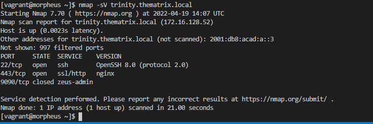
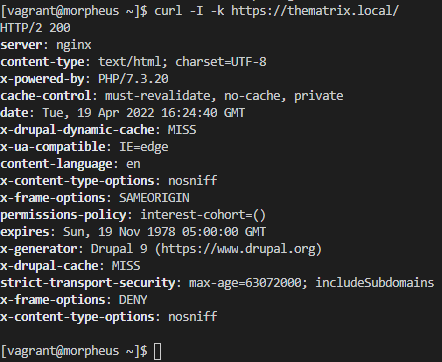
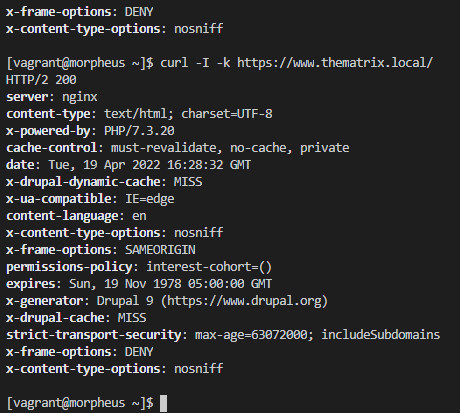
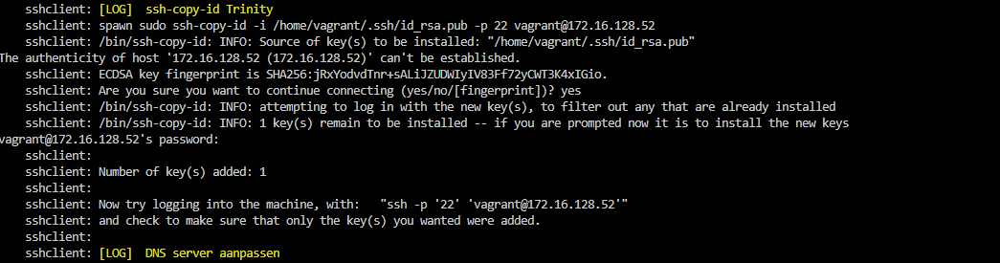
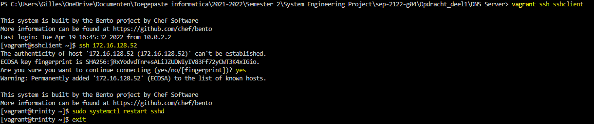
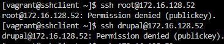
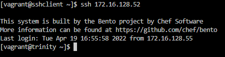

# Testplan: Webserver bash script Linux

Auteur(s) testplan: Jarne Bottelberghe

## Configuratie

De tester moet in staat zijn om de webserver server online te kunnen stellen zonder enige input van de tester.

Als u al deze testen correct kan uitvoeren (zoals geïllustreerd in de screenshots) dan is de webserver volledig geconfigureerd en operationeel.

1. Pas alvorens het beginnen van de configuratie de variabelen USERNAME en PASSWORD aan naar uw persoonlijke perferencies. (u kan dit doen bovenaan het configuratiescript trinity.sh)

   

2. Start de dns-server op.(instructies voor de installatie hiervan staan in het testplan van de dns server)

3. Start vervolgens de webserver op door het trinity.sh bestand uit te voeren in de vagrant omgeving.
   

4. Als het script volledig is uitgevoerd (zoals hieronder geïllustreerd) dan is de webserver volledig geconfigureerd.
   

## Testing

3. Controleer dat de versie van onze webserver niet achterna te halen is via nmap.

   (We gebruiken hiervoor het commando nmap -sV op het ip addres van de webserver)

    

4. Gebruik het commando: curl -l -k https://thematrix.local/ en curl -l -k https://www.thematrix.local/ 
op een linux systeem in het netwerk om na te als de webserver gebruikt baar is via de dns server
   
 
   
5. Zoek https://172.16.128.52 om te controleren als de webserver te bereiken is via een webbrowser naar keuze op een wekstation binnen het netwerk.

   

   1. Selecteer de taal English om de configuratie verder te doen

   

   2. Selecteer de standard versie

      

   3. Vul de volgende gegevens in

      

   4. vul uw gegevens in 

      

   5. Als u deze pagina berijkt hebt dan is de webserver volledig operationeel en geconfigureerd

      

6. Om te controleren of SSH werkt zoals het moet starten we "sshclient" op. Om te controleren of de keys zijn toegevoegd aan de "trinity" vm moet je volgende output zien:

7. nu gaan we ssh'en naar de sshclient en moet de ssh server op 'trinity' nog manueel herstart worden. dit kan via volgend commando's: 
   * vagrant ssh sshclient
   * ssh 172.16.128.52 (vervolgens yes intypen)
   * sudo systemctl restart sshd
   * exit

8. Nu controleren we of je nog met de root kan inloggen of bijvoorbeeld een andere gebruiker 'drupal' vanaf sshclient naar trinity. Dit zou niet mogen werken!
   * ssh root@172.16.128.52
   * ssh drupal@172.16.128.52
   

9. Als laatste bevestigen we nog even of we met de public key kunnen inloggen door het commando: ssh 172.16.128.52
   

