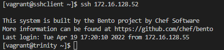

# Testrapport Opdracht 1: Web-Server bash script Linux


## Test 1

Uitvoerder(s) test: Joris D'haen

Uitgevoerd op: 19/04/2022

Github commit: 11903c6e60123117dc9ba03e4d4a5a6d079633c0  

## Test configuratie

1. Pas alvorens het beginnen van de configuratie de variabelen USERNAME en PASSWORD aan naar uw persoonlijke perferencies

```bash
DNSSERVERFILE="/etc/resolv.conf"
USERNAME="drupal"
DOMAINNAME="thematrix.local"
PASSWORD="Admin2022"
```

2. Start de dns-server op.(instructies voor de installatie hiervan staan in het testplan van de dns server)


OK

3. Start vervolgens de webserver op door het trinity.sh bestand uit te voeren in de vagrant omgeving.


OK

## Testing

3. Controleer dat de versie van onze webserver niet achterna te halen is via nmap.


OK

4. Gebruik het commando: curl -l -k https://thematrix.local/ en curl -l -k https://www.thematrix.local/ op een linux systeem in het netwerk om na te als de webserver gebruikt baar is via de dns server


OK

5. Zoek https://172.16.128.52 om te controleren als de webserver te bereiken is via een webbrowser naar keuze op een wekstation binnen het netwerk. 


OK

6. Om te controleren of SSH werkt zoals het moet starten we "sshclient" op. Om te controleren of de keys zijn toegevoegd aan de "trinity" vm moet je volgende output zien:


OK

7. Nu gaan we ssh'en naar de sshclient en moet de ssh server op 'trinity' nog manueel herstart worden. dit kan via volgend commando's:


OK

8. Nu controleren we of je nog met de root kan inloggen of bijvoorbeeld een andere gebruiker 'drupal' vanaf sshclient naar trinity. Dit zou niet mogen werken!


OK

9. Als laatste bevestigen we nog even of we met de public key kunnen inloggen door het commando: ssh 172.16.128.52


OK