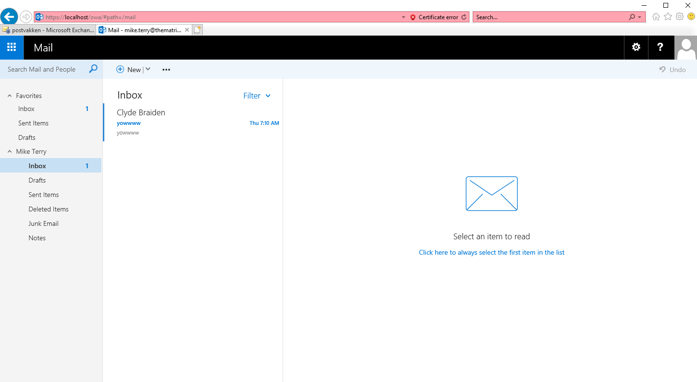

# Testplan: Email Server neo Powershell scripts

Auteur(s) testplan: Joris D'haen

## Configuratie Domein Controller voor Exchange 2019

### Voorbereiding Domeincontroller voor Microsoft Exchange installatie

1. Download Exchange 2019 en .NET 4.8 (download links staan in het script)

2. Verander eventueel de variabelen (lijn 22-23)
```powershell
# Variables
$ExchangeInstallationMedia = "F:"
$DotNetInstallationMedia = "C:\ndp48-x86-x64-allos-enu.exe"
```

3. Run het DC_Script_Prerequisites.ps1 script

4. Indien er gewerkt wordt binnen 1 netwerk via een bridged adapter is het aangeraden om te werken met verschillende Admin accounts.
    Run daarom de onderste lijnen van het script DC_Script_Users.ps1 uit.

```powershell
# Creating MDT and Exchange Admin accounts
New-ADUser -Name "EchangeAdmin" -SamAccountName "ExchangeAdmin" -AccountPassword $securepassword -PasswordNeverExpires:$true -ChangePasswordAtLogon $false -Enabled $true
Add-ADGroupMember -Identity "Administrators" -Members "ExchangeAdmin"
Add-ADGroupMember -Identity "Domain Admins" -Members "ExchangeAdmin"
```

## Configuratie Email Server

### Aanmaken van een Windows Server 2019 machine in Oracle VM Virtualbox

1. Maak in Oracle VM Virtualbox een nieuwe VM aan met de volgende eigenschappen:

    -  2 harde schijven van elk 50gb
    - NAT adapter en host-only adapter (verbonden met de dns server en domeincontroller)
    - 8192mb RAM
    - 2 cpu's

2. Installeer Windows Server 2019 desktop experience op de virtuele machine

3. Installeer de Virtualbox Guest Additions op de virtuele machine

### Email Server neo basisconfiguratie

Opmerking! Zorg dat u altijd bent ingelogd als domein administrator (THEMATRIX\Administrator of THEMATRIX\EchangeAdmin)

1. Run het neo_Script_Configuration.ps1 script

2. Verander eventueel de variabelen (lijn 18-24)
```powershell
# Parameters
$ComputerName = "neo"
$Adapter = "Ethernet"
$Adapter2 = "Ethernet 2"
$IP_Adress = "172.16.128.53"
$NetMask = "28"
$DefaultGateway = "172.16.128.49"
$DNSServer = "172.16.128.51"
```

3. De computernaam is veranderd naar neo. De 2 netwerkadapters (WAN en LAN) zien er als volgt uit: 


### Email Server toevoegen aan het domein

1. Run het neo_Script_JoinDomain.ps1 script

2. Neo is toegevoegd aan het domein thematrix.local


### Voorbereiding neo voor Microsoft xchange installatie

1. Download .NET 4.8, Visual C++ Redistributable Packages en Unified Communications Managed API 4.0 Runtime (download links staan in het script)

2. Open het neo_Script_ExchangePreparation.ps1 script en verander eventueel de variabelen (lijnen 24-27)
```powershell
# Variables
$DotNetInstallationMedia = "C:\ndp48-x86-x64-allos-enu.exe"
$C2013x64InstallationMedia = "C:\vcredist_x64.exe"
$C2013x86InstallationMedia = "C:\vcredist_x86.exe"
$UcmaInstallationMedia = "C:\UcmaRuntimeSetup.exe"
```

3. Run het script

### Installatie Microsoft Exchange 2019

1. Download Microsoft Exchange 2019

2. Open het neo_Script_ExchangeInstall.ps1 script en verander eventueel de variabelen (lijn 21)
```powershell
#Variables
$ExchangeInstallationMedia = "E:"
```

3. Run het script, uitvoer: 


### Configuratie Microsoft Exchange 2019

1. Run het neo_Script_ExchangeConfiguration.ps1 script

2. Exchange is nu volledig geconfigureerd

### Testing 

1. Iemand met een user account moet in staat zijn om een mail te sturen naar een andere user binnen het netwerk

