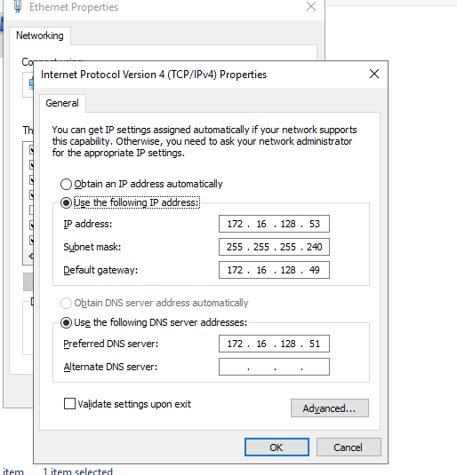
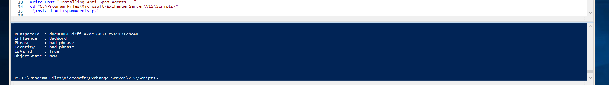
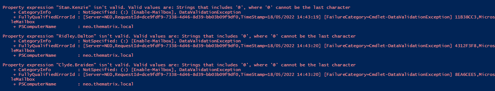
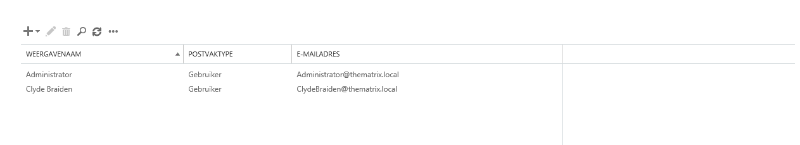
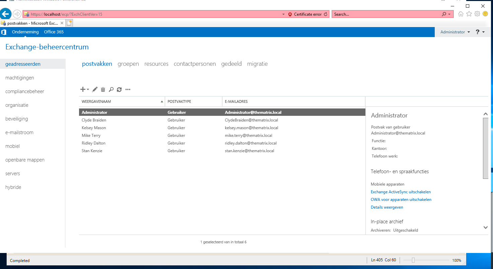
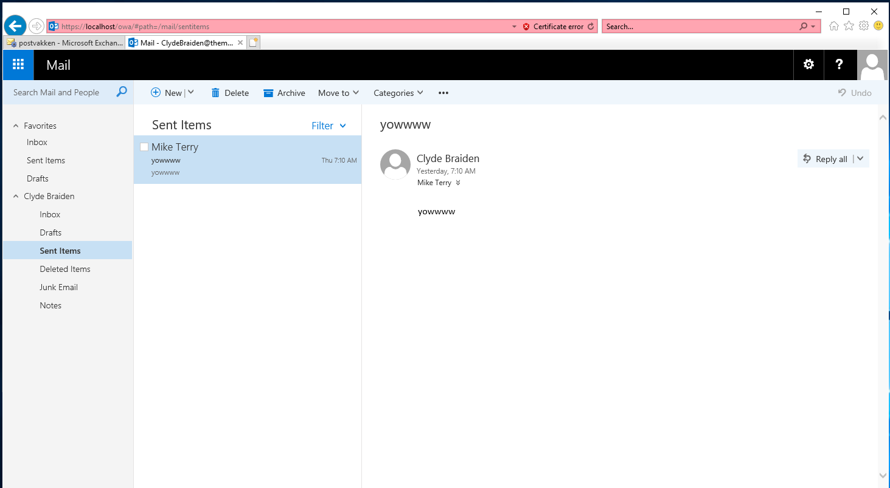

# Testrapport Mailserver

(Een testrapport is het verslag van de uitvoering van het testplan door een teamlid (iemand anders dan de auteur van het testplan!). Deze noteert bij elke stap in het testplan of het bekomen resultaat overeenstemt met wat verwacht werd. Indien niet, dan is het belangrijk om gedetailleerd op te geven wat er misloopt, wat het effectieve resultaat was, welke foutboodschappen gegenereerd werden, enz. De tester kan meteen een Github issue aanmaken en er vanuit het testrapport naar verwijzen. Wanneer het probleem opgelost werdt, wordt een nieuwe test uitgevoerd, met een nieuw verslag.)

## info

Uitvoerder(s) test: Jarne
Uitgevoerd op: 18/05/2022
Github commit:  COMMIT HASH

## Tests

na het installeren van de vm en het runnen van neo_Script_Configuration.ps1 is de basisconfig van de webserver conpleet en zijn de interfaces correct ingesteld 

Na het runnen van het script van de prerequesites kwam ik tot de conclusie dat de instalatie niet ging omdat de laatste lijntjes niet uitgevoerd werden(dit is door de forced restart). Oftewel moeten we in het testplan zetten dat we het script in 2 keer moeten uitvoeren oftwel moeten we deze restart uit het script halen,dit valt nog te overleggen.

Na het runnen van deze laatste paar lijnen dan werkt de configuratie wel 

Nadat de configuratie goed was gegelukt en ik de mailserver kon bereiken liep ik nog tegen een probleem bij het uitvoeren van neo_Script_ExchangeConfiguration.ps1 script. 

Mijn script uitkomst kwam niet overeen met die van het testplan dus ik vond deze foutmeldingen na een beetje scrollen.

 

We hebben uiteindelijk de fout wel kunnen oplossen. Om de user toe te kunnen voegen aan de mail server moeten we de alias van deze bewerken, we moeten namelijk de punten die tussen hun naam en voornaam staan verwijderen, als we dit doen dan kunnen we manueel en gebruiker aanmaken.

nadat we de user manueel konden toevoegen probeerde ik nog keer het script te herrunnen en deze werkte deze keer wel zonder foutmeldingen. Na het runnen van het script waren alle user toegevoegd.

de mailserver is nu volledig geconfigureerd en ik kan mail sturen naar mede users in het netwerk.

De Webserver is nu volledig geconfigureerd en operationeel dus de testen zijn geslaagd.