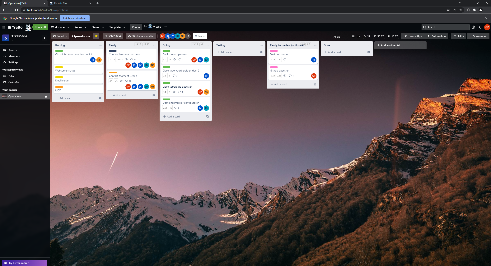
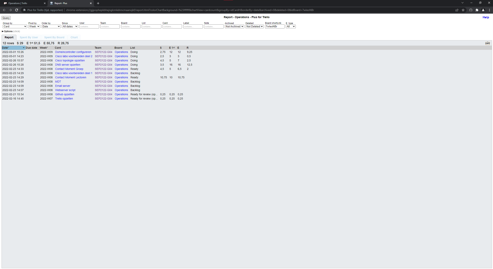
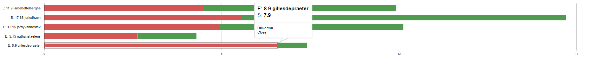
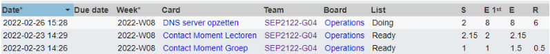
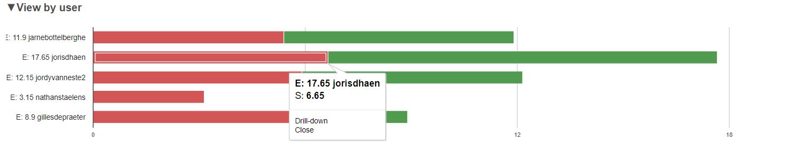
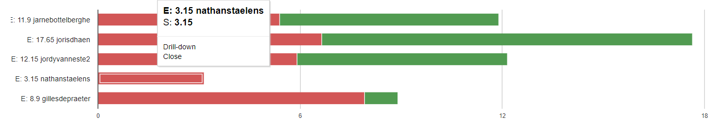

# Voortgangsrapport week 02

* Groep: 4 
* Datum voortgangsgesprek: 02/03/2022

| Student            | Aanw. | Opmerking |
| :----------------- | :---- | :-------- |
| Gilles De Praeter  |       |           |
| Jarne Bottelberghe |   x    |           |
| Jordy Vanneste     |   x   |           |
| Joris D'haen       |   x  |           |
| Nathan Staelens    |   x    |           |

## Wat heb je deze week gerealiseerd?

### Algemeen
  

  

### Gilles De Praeter

* Netwerkconfiguratie in packet tracer nagebootst. Deze bevat een basisconfiguratie van routers en switches, router-on-a-stick-configuratie en de statische addressering van de servers.
* De adresseringstabel aangevuld zodat ik deze kon gebruiken voor de packet tracer

  

### Jarne Bottelberghe

* Opzoekwerk dns server

* Eerste stukjes code dns-script geschreven

  

### Jordy Vanneste

* begonnen aan cisco labo deel 2
* script groups voor domein controller

[Afbeelding individueel rapport tijdregistratie]

### Joris D'haen

* Begonnen aan vagrant file voor de DNS Server
* Twee Powershell scripts geschreven voor de Domeincontroller (instellen computernaam, netwerkadapter en het thematrix.local domein aanmaken)
* De adresseringstabel aangevuld

[Afbeelding individueel rapport tijdregistratie]

### Nathan Staelens

* ...

## Wat plan je volgende week te doen?

### Algemeen

### Gilles De Praeter

* Netwerkconfiguratie afwerken, meehelpen aan de configuratie van de DNS-server, aanpassen adresseringstabel indien nodig.

### Jarne Bottelberghe

* Verder werken aan de configuratie van de dns server eens dat we de definitieve addrestabel kunnen gebruiken

### Joris D'haen

* Verder werken aan de configuratie van de dns server eens dat we de definitieve addrestabel kunnen gebruiken
* Verder werken aan de scripts voor de domeincontroller

### Jordy Vanneste

* Verder werken aan cisco labo deel 2 en domein controller

### Nathan Staelens

* Cisco labo 1 voorbereiden

## Waar hebben jullie nog problemen mee?

* Vragen Gilles:
  * Moeten switches IP addressen hebben?
  * Hoeveel hostst per VLAN (= is onze addresseringstabel juist)?
  * Nog VLAN's gewenst buiten de gegeven VLAN's (zoals Management, ...)?
  * Moeten switches/routers bepaalde security measures hebben?
  * Gebruiken we voor de servers te visualiseren best PC's of echte Servers?
  * DHCP ook in cisco implementeren?
  * Hoe router-on-a-stick en internet laten samenwerken?

* ...

## Feedback technisch luik

### Algemeen

### Gilles De Praeter

### Jarne Bottelberghe

### Jordy Vanneste

### Joris D'haen

### Student 5

## Feedback analyseluik

### Algemeen

### Gilles De Praeter

### Jarne Bottelberghe

### Jordy Vanneste

### Joris D'haen

### Nathan Staelens
