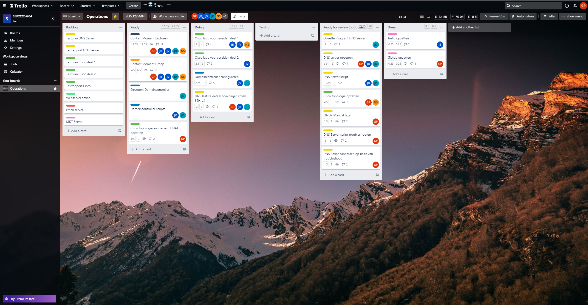
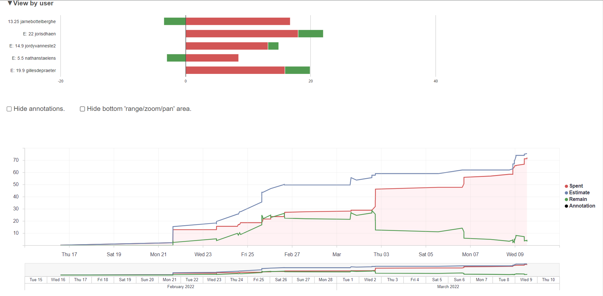
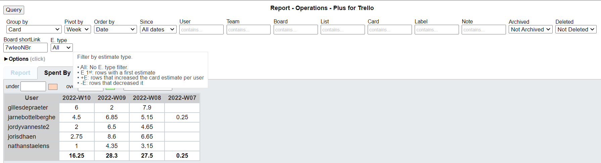
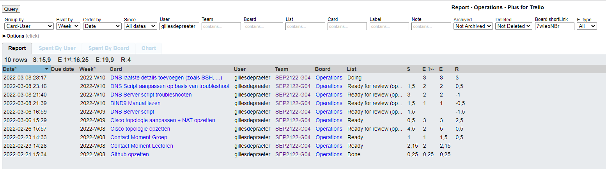
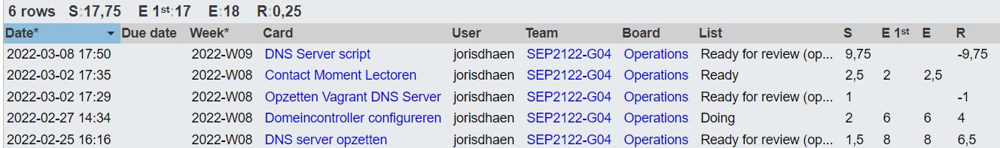
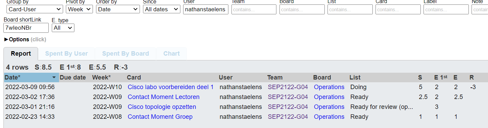

# Voortgangsrapport week 3

* Groep: 4 
* Datum voortgangsgesprek: 

| Student            | Aanw. | Opmerking |
| :----------------- | :---- | :-------- |
| Gilles De Praeter  |       |           |
| Jarne Bottelberghe |       |           |
| Jordy Vanneste     |       |           |
| Joris D'haen       |       |           |
| Nathan Staelens    |       |           |

## Wat heb je deze week gerealiseerd?

### Algemeen

### Gilles De Praeter

* Netwerkconfiguratie aangepast op basis van feedback
* BIND9 manual gelezen
* DNS server getroubleshoot, aanpassingen aan algemeen script aangebracht op basis van troubleshoot en BIND9 manual
* eigen DNS script geschreven op basis van troubleshoot

  

### Jarne Bottelberghe

* DNS server script opstellen 

* troubleshooting dns configuratie

* testplan dns server opstellen

  

  

### Jordy Vanneste

* gewerkt aan Cisco labo deel 1
* Testrapport DNS server

### Joris D'haen

* DNS server script opstellen en troubleshooten
* Script geschreven voor domeincontroller
* Vagrant omgeving aangemaakt web server

### Nathan Staelens

* Cisco labo deel 1 + troubleshoot

## Wat plan je volgende week te doen?

### Algemeen

### Gilles De Praeter

* DNS script afwerken door laatste details toe te voegen
* Domein controller helpen afwerken
* Eventueel Netwerkconfiguratie in PT aanpassen / afwerken 

### Jarne Bottelberghe

* beginnen met script webserver
* kijken voor cisco labo deel1

### Jordy Vanneste
-afwerken cisco labo deel 1
-Domein controller afwerken

### Joris D'haen

* DNS script afwerken door laatste details toe te voegen
* Domein controller afwerken
* Eventueel beginnen configuratie webserver

### Nathan Staelens

* labo deel 1 afwerken
* testplan labo deel 1?
* domeincontroller

## Waar hebben jullie nog problemen mee?

* ...
* ...

## Feedback technisch luik

### Algemeen

### Gilles De Praeter

### Jarne Bottelberghe

### Jordy Vanneste

### Joris D'haen

### Nathan Staelens

## Feedback analyseluik

### Algemeen

### Gilles De Praeter

### Jarne Bottelberghe

### Jordy Vanneste

### Joris D'haen

### Nathan Staelens
