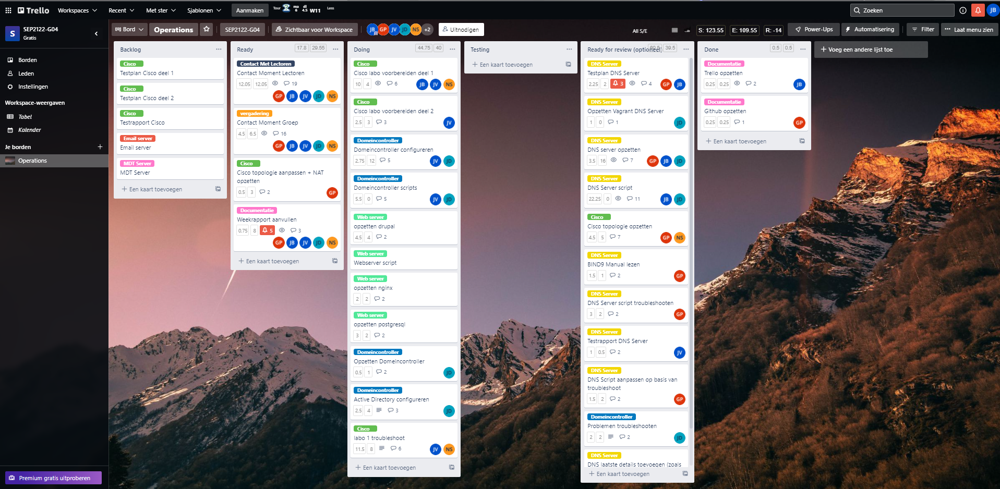
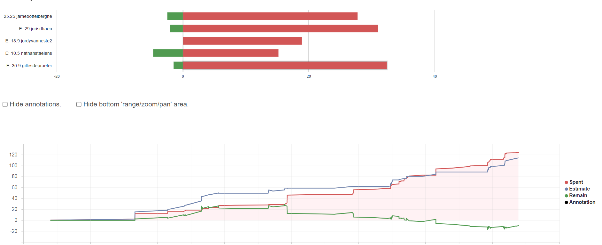
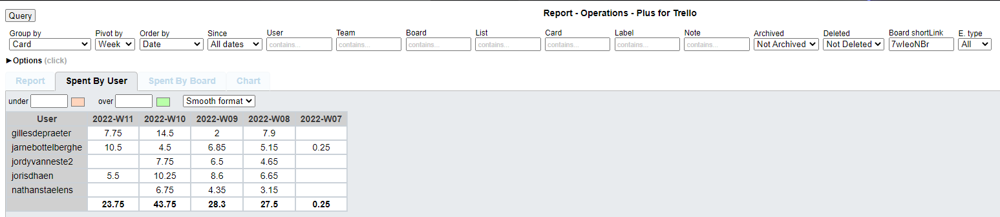
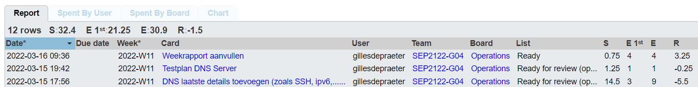
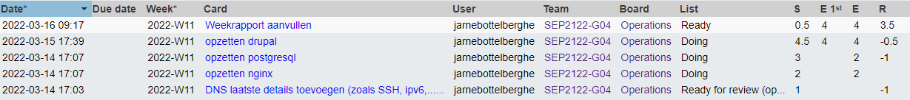
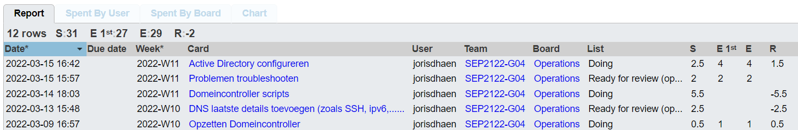
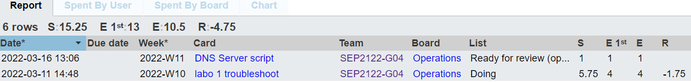

# Voortgangsrapport week 4

* Groep: 4 
* Datum voortgangsgesprek: 16/03/2022

| Student            | Aanw. | Opmerking |
| :----------------- | :---- | :-------- |
| Gilles De Praeter  |       |           |
| Jarne Bottelberghe |       |           |
| Jordy Vanneste     |       |           |
| Joris D'haen       |       |           |
| Nathan Staelens    |       |           |

## Wat heb je deze week gerealiseerd?

### Algemeen

### Gilles De Praeter

* IPv6 in DNS script geïmplementeerd
* ssh in DNS script geïmplementeerd

[Afbeelding individueel rapport tijdregistratie]

### Jarne Bottelberghe 

* dns configuratie 
* script webserverschrijven

### Jordy Vanneste

* ...

[Afbeelding individueel rapport tijdregistratie]

### Joris D'haen

* IPv6 in DNS script geïmplementeerd
* Scripts geschreven voor de domeincontroller
* Scripts geschreven voor een werkstation
* Begonnen aan de group policy's domeincontroller

[Afbeelding individueel rapport tijdregistratie]

### Nathan Staelens

* Testplan cisco labo deel 1
* dns ipv6 script

## Wat plan je volgende week te doen?

### Algemeen

### Gilles De Praeter

* AD configuratie volledig afwerken en werken aan het script van de webserver

### Jarne Bottelberghe

* werken aan het script van de webserver

### Jordy Vanneste

### Joris D'haen

* AD configuratie volledig afwerken (gpo's) en werken aan het script van de webserver

### Nathan Staelens

* AD config
* labo 1 testplan afwerken

## Waar hebben jullie nog problemen mee?

* cisco labo deel 1: ospf staische route loopback, pingen tss pc's niet mogelijk, wel tss routers

## Feedback technisch luik

### Algemeen

### Gilles De Praeter

### Jarne Bottelberghe

### Jordy Vanneste

### Joris D'haen

### Nathan Staelens

## Feedback analyseluik

### Algemeen

### Gilles De Praeter

### Jarne Bottelberghe

### Jordy Vanneste

### Joris D'haen

### Nathan Staelens
