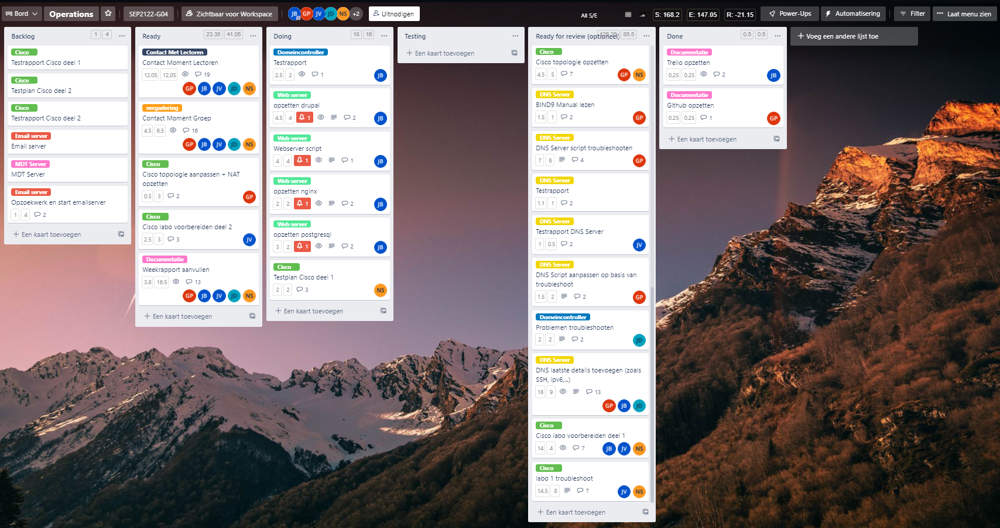
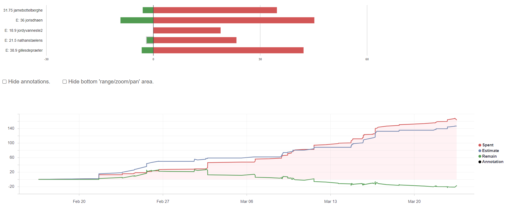
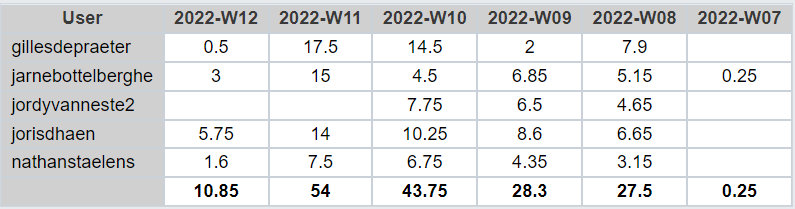
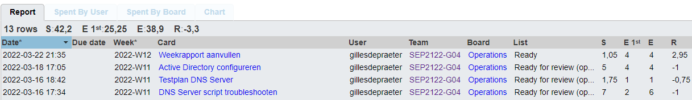
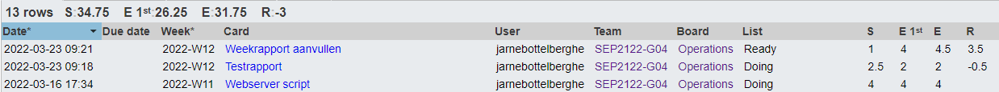
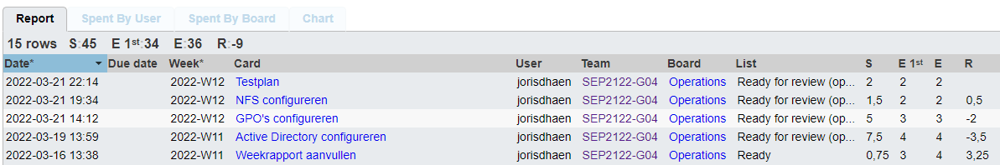
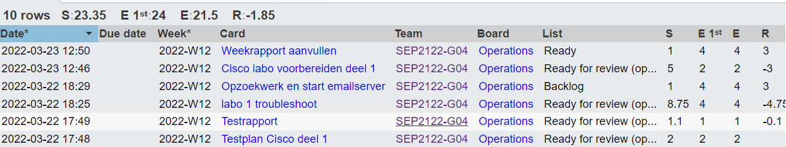

# Voortgangsrapport week 5

- Groep: 4
- Datum voortgangsgesprek: 23/03/2022

| Student            | Aanw. | Opmerking |
| :----------------- | :---- | :-------- |
| Gilles De Praeter  |       |           |
| Jarne Bottelberghe |       |           |
| Jordy Vanneste     |       |           |
| Joris D'haen       |       |           |
| Nathan Staelens    |       |           |

## Wat heb je deze week gerealiseerd?

### Algemeen

### Gilles De Praeter

- DNS server script getroubleshoot
- DNS testplan afgewerkt
- Geholpen bij de scripts voor de domeincontroller
- Gezorgd dat de DNS en domeincontroller kunnen communiceren en samenwerken

### Jarne Bottelberghe

- Verder gewerkt aan webserver
- testplan domeincontroller gemaakt

### Jordy Vanneste

- ...

[Afbeelding individueel rapport tijdregistratie]

### Joris D'haen

- Alle scripts voor de domeincontroller afgewerkt
- De Active Directory van de domeincontroller geconfigureerd en gefinaliseerd
- NFS geïmplementeerd in de domeincontroller aan de hand van een Powershell script
- Testplan van de domeincontroller opgesteld

### Nathan Staelens

- afwerken testplan cisco deel 1
- begin en onderzoek emailserver
- testrapport DNS-server

## Wat plan je volgende week te doen?

### Algemeen

### Gilles De Praeter

- Helpen bij de configuratie en automatisatie van de Web Server
- Beginnen aan de configuratie van de Email Server

### Jarne Bottelberghe

- configuratie en automatisatie van de Web Server
- Eventueel kijken naar email server (indien webserver vroegtijdig klaar is)

### Jordy Vanneste

### Joris D'haen

- Helpen bij de configuratie en automatisatie van de Web Server
- Beginnen aan de configuratie van de Email Server
- Eventueel al is kijken naar de Microsoft Deployment Toolkit

### Nathan Staelens

## Waar hebben jullie nog problemen mee?

- ...
- ...

## Feedback technisch luik

## DNS
* Documentatie aanwezig?
	- [X] Lastenboek -> Team heeft dit foutief begrepen en dacht dat dit Trello was, opnieuw gevalideerd op 20/4/22.
	- [X] Testplan
	- [X] Testrapport
	- [X] Technische documentatie (incl. scripts)
* Technische uitwerking
	- [X] Zonefile met records (SOA, NS, ...) aanwezig
	- [X] Ping agentsmith.thematrix.local -> ook zonder domein mogelijk om machines op basis van naam te pingen (resolv.conf)
	- [X] SSH met gebruiker root faalt
	- [X] SSH met public key + ip a -> IP: 172.16.128.51
	- [X] Nslookup agentsmith.thematrix.local -> DNS
	- [X] Nslookup google.be -> Google DNS niet bereikbaar via HoGent netwerk, Cloudflare 1.1.1.1 werkt of via VPN

## AD
* Documentatie
	- [X] Lastenboek -> Team heeft dit foutief begrepen en dacht dat dit Trello was, opnieuw gevalideerd op 20/4/22.
	- [X] Testplan -> Let op dat een testplan geen installatieprocedure is.
	- [X] Testrapport
	- [X] Technische documentatie (incl. scripts)
* Technische uitwerking
	- [X] Domein "thematrix.local"
	- [X] Ping morpheus.thematrix.local -> ook zonder domain mogelijk, op basis van machinenaam
	- [X] OUs, gebruikers en computers gedefinieerd -> toegevoegde client in domein zichtbaar
	- [X] Bewijs van policies -> nog te bekijken in het script
		* enkel IT Administratie kan control panel openen
		* games link menu niet beschikbaar
		* Administratie en Verkoop geen toegang netwerkadapters
	- [X] Gebruikersmappen aanwezig

## Feedback analyseluik

### Algemeen

### Gilles De Praeter

### Jarne Bottelberghe

### Jordy Vanneste

### Joris D'haen

### Nathan Staelens
