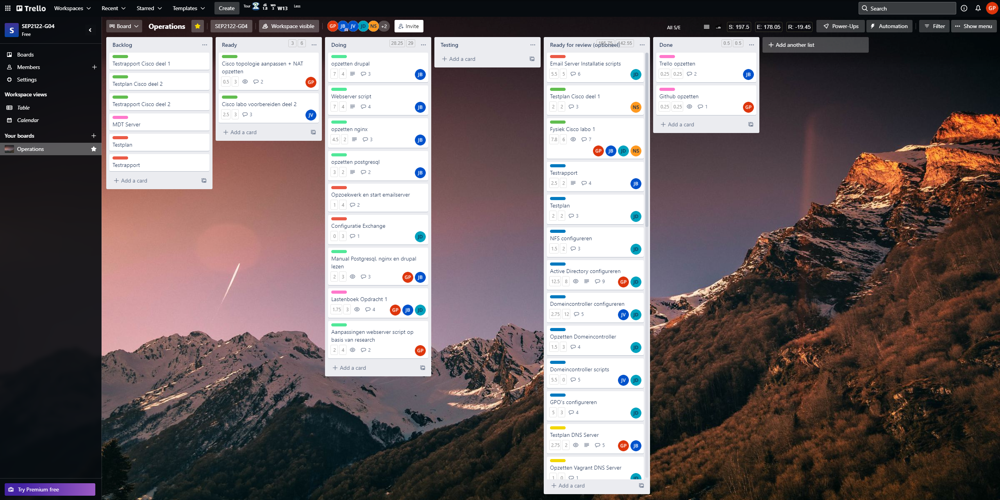
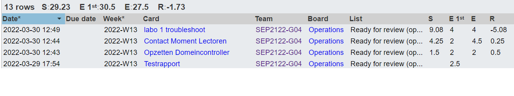
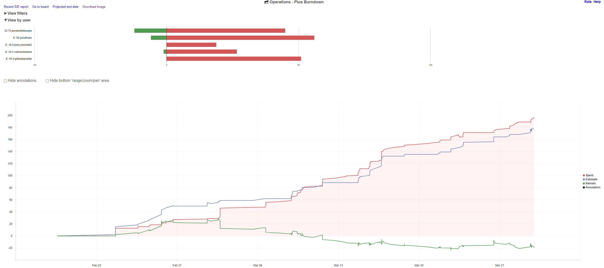
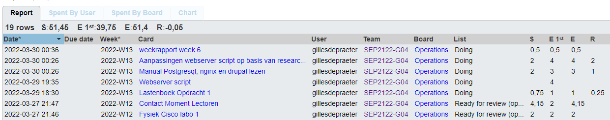
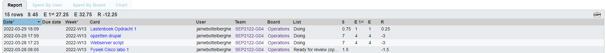
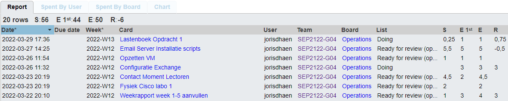

# Voortgangsrapport week 6

* Groep: 4 
* Datum voortgangsgesprek: 30/03/2022

| Student            | Aanw. | Opmerking |
| :----------------- | :---- | :-------- |
| Gilles De Praeter  |       |           |
| Jarne Bottelberghe |       |           |
| Jordy Vanneste     |       |           |
| Joris D'haen       |       |           |
| Nathan Staelens    |       |           |

## Wat heb je deze week gerealiseerd?

### Algemeen

### Gilles De Praeter

* Lastenboek DNS + domein controller gemaakt
* research gedaan naar postgresql en nginx
* eigen versie script trinity gemaakt

### Jarne Bottelberghe

* geholpen met fysiek labo
* verder gewerkt webserver
* lastenboek deel1

### Jordy Vanneste

* ...

[Afbeelding individueel rapport tijdregistratie]

### Joris D'haen

* Opzetten van de Email Server
* Installatie van de Email Server volledig geautomatiseerd/gescript
* Begonnen aan de configuratie van de Email Server

### Nathan Staelens

* config bestand labo cisco
* domeincontroller opgezet

## Wat plan je volgende week te doen?

### Algemeen

### Gilles De Praeter

* Nginx + drupal verder configureren
* Eventueel al aan mdt server beginnen
### Jarne Bottelberghe

* Nginx + drupal verder configureren
* Eventueel kijken voor appache en mariadb te gebruiken omdat dit nu wel mag

### Jordy Vanneste

### Joris D'haen

* Configuratie van de Email Server afwerken
* Testplan Email Server opstellen (indien vorig puntje klaar)

### Nathan Staelens

* mailserver afwerken
* eventueel mdt

## Waar hebben jullie nog problemen mee?

* ...
* ...

## Feedback technisch luik

### Algemeen

### Gilles De Praeter

### Jarne Bottelberghe

### Jordy Vanneste

### Joris D'haen

### Nathan Staelens

## Feedback analyseluik

### Algemeen

### Gilles De Praeter

### Jarne Bottelberghe

### Jordy Vanneste

### Joris D'haen

### Nathan Staelens