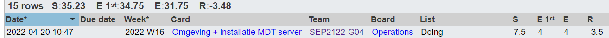

# Voortgangsrapport week 7

- Groep: 4
- Datum voortgangsgesprek: 20/04/2022

| Student            | Aanw. | Opmerking |
| :----------------- | :---- | :-------- |
| Gilles De Praeter  |       |           |
| Jarne Bottelberghe |       |           |
| Jordy Vanneste     |       |           |
| Joris D'haen       |       |           |
| Nathan Staelens    |       |           |

## Wat heb je deze week gerealiseerd?

### Algemeen

### Gilles De Praeter

- Configuratie nginx, postgresql en drupal afgerond (inclusief ssh en de versie eruit halen).
- Testplan webserver uitgebreid met het ssh gedeelte

[Afbeelding individueel rapport tijdregistratie]

### Jarne Bottelberghe

- webserver afgewerkt
- testplan webserver
- lastenboek webserver

### Jordy Vanneste

- ...

[Afbeelding individueel rapport tijdregistratie]

### Joris D'haen

- Opzetten email server neo
- Installeren Microsoft Exchange 2019 via scripts
- Configureren Microsoft Exchange 2019 via scripts

### Nathan Staelens

- Omgeving opzetten MDT server
- MDT installeren

## Wat plan je volgende week te doen?

### Algemeen

### Gilles De Praeter

- mdt server beginnen
- cisco opdracht eventueel beginnen

### Jarne Bottelberghe

### Jordy Vanneste

### Joris D'haen

- Email server volledig afwerken (evt fouten er uit halen dmv testen)
- Schrijven testplan email server
- Beginnen aan mdt server

### Nathan Staelens

- scripts MDT verbeteren
- eerste images proberen uitrollen met MDT

## Waar hebben jullie nog problemen mee?

- ...
- ...

## Feedback technisch luik

### Checklist Webserver
* NGinx, Postgresql, Drupal opgezet 
* Documentatie aanwezig?
	- [X] Lastenboek
	- [X] Testplan
	- [X] Testrapport
	- [X] Technische documentatie (incl. scripts)
* Technische uitwerking
	- [X] SSH toegang met keys
	- [X] SSH niet mogelijk met root account
	- [X] SSH niet mogelijk met wachtwoord
	- [X] Versie webserver ontzichtbaar (nmap)
	- [X] Surfen via HTTPS naar CMS is mogelijk
		- [X] https://www.thematrix.local/
		- [X] https://thematrix.local/
	- [X] Een post kan aangemaakt worden in de CMS
* Webserver prima uitgewerkt, scripts zien er ook goed uitgewerkt uit
