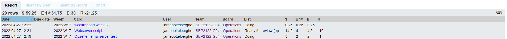
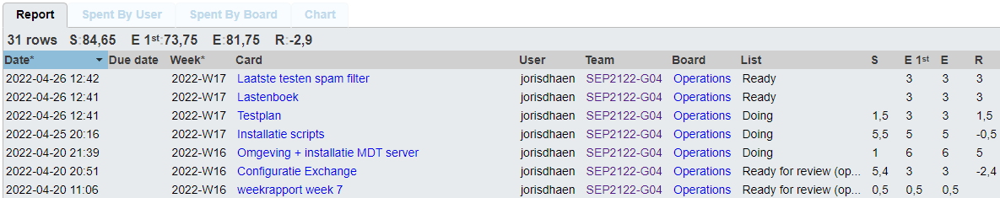
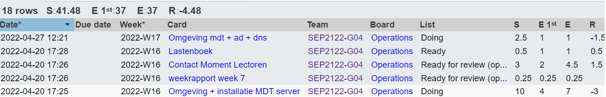

# Voortgangsrapport week 8

- Groep: 4
- Datum voortgangsgesprek: 27/04/2022

| Student            | Aanw. | Opmerking |
| :----------------- | :---- | :-------- |
| Gilles De Praeter  |       |           |
| Jarne Bottelberghe |       |           |
| Jordy Vanneste     |       |           |
| Joris D'haen       |       |           |
| Nathan Staelens    |       |           |

## Wat heb je deze week gerealiseerd?

### Algemeen

### Gilles De Praeter

- Het webserver script van Jarne nagekeken en getroubleshoot.

### Jarne Bottelberghe

- ...

### Jordy Vanneste

- ...

[Afbeelding individueel rapport tijdregistratie]

### Joris D'haen

- Powershell script geschreven voor de volledige installatie van MDT
- Testplan email server geschreven

### Nathan Staelens

- omgeving op desktop opgezet voor mdt

## Wat plan je volgende week te doen?

### Algemeen

### Gilles De Praeter

- cisco labo 2
- mdt server bekijken en aan de scripts werken

### Jarne Bottelberghe

- cisco labo 2
- mdt server bekijken 
- eventueel testrapport mailserver (nog niet zeker)

### Jordy Vanneste

### Joris D'haen

- Laatste testen toepassen op de spam filter van de email server
- testplan email server afschrijven
- starten met het maken van een mdt deploy image

### Nathan Staelens

- cisco labo 2 voorbereiden
- met mdt images deployen

## Waar hebben jullie nog problemen mee?

- ...
- ...

## Feedback technisch luik

### Algemeen

### Gilles De Praeter

### Jarne Bottelberghe

### Jordy Vanneste

### Joris D'haen

### Nathan Staelens

## Feedback analyseluik

### Algemeen

### Gilles De Praeter

### Jarne Bottelberghe

### Jordy Vanneste

### Joris D'haen

### Nathan Staelens
