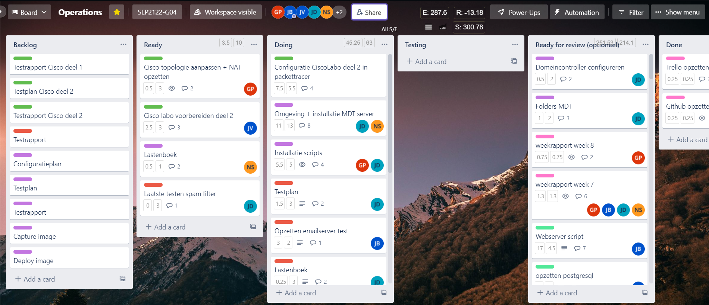
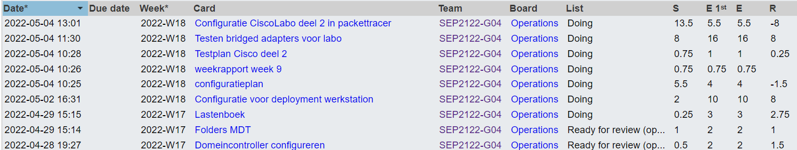
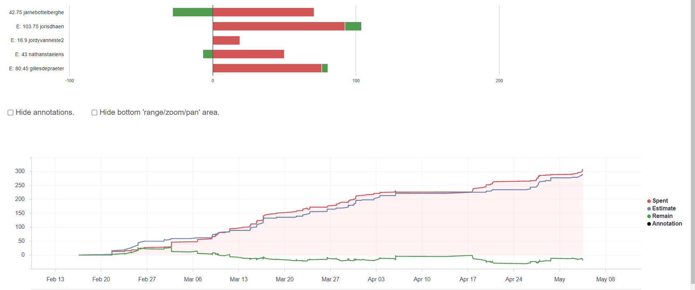
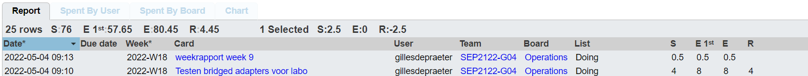
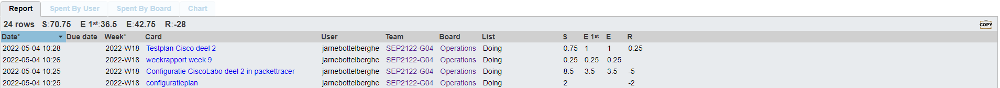
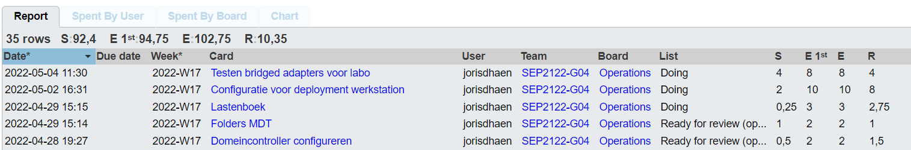
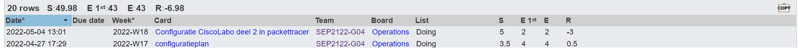

# Voortgangsrapport week 09

- Groep: 4
- Datum voortgangsgesprek: 02/05/2022

| Student            | Aanw. | Opmerking |
| :----------------- | :---- | :-------- |
| Gilles De Praeter  |       |           |
| Jarne Bottelberghe |       |           |
| Jordy Vanneste     |       |           |
| Joris D'haen       |       |           |
| Nathan Staelens    |       |           |

## Wat heb je deze week gerealiseerd?

### Algemeen

### Gilles De Praeter

- bridged adapter bekijken en configureren

### Jarne Bottelberghe

- cisco labo deel 2
- tesplan cisco labo deel 2

### Jordy Vanneste

- ...

[Afbeelding individueel rapport tijdregistratie]

### Joris D'haen

- Bridged adapter bekijken en configureren
- Lastenboek email server opgesteld
- Configuratie MDT aan de hand van scripts

### Nathan Staelens

- cisco labo deel 2
- configuratieplan labo 2
- troubleshoot labo 2

## Wat plan je volgende week te doen?

### Algemeen

### Gilles De Praeter

- mdt server bekijken en aan de scripts werken

### Jarne Bottelberghe

- Cisco Labo 2 troubleshoot
- Cisco labo 2 fysiek uitvoeren
- opzetten email server

### Jordy Vanneste

### Joris D'haen

- Verder werken aan configuratie mdt server
- Testplan email server afwerken
- Laaste tests op de email server

### Nathan Staelens

- testplan labo 2 afwerken
- mdt verder configureren en images uitrollen

## Waar hebben jullie nog problemen mee?

- ...
- ...

## Feedback technisch luik

### Algemeen

### Gilles De Praeter

### Jarne Bottelberghe

### Jordy Vanneste

### Joris D'haen

### Nathan Staelens

## Feedback analyseluik

### Algemeen

### Gilles De Praeter

### Jarne Bottelberghe

### Jordy Vanneste

### Joris D'haen

### Nathan Staelens
