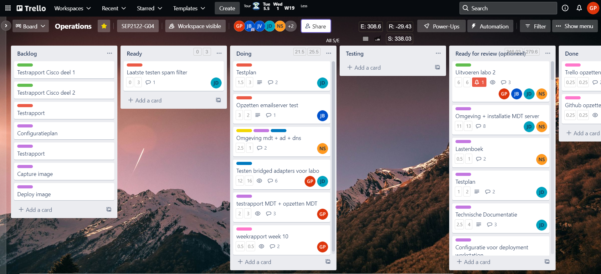
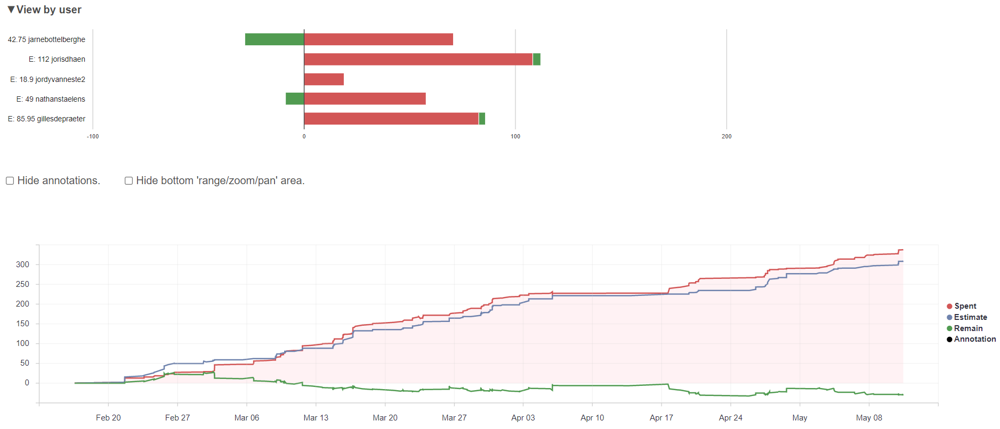
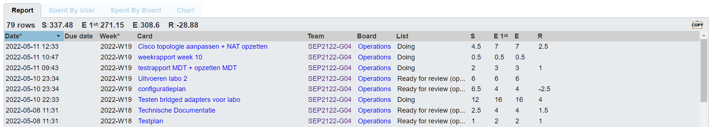
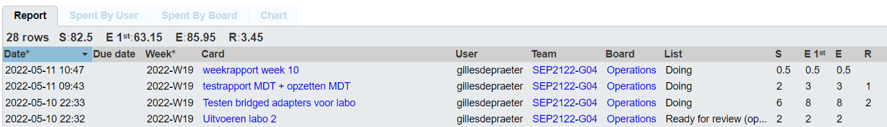
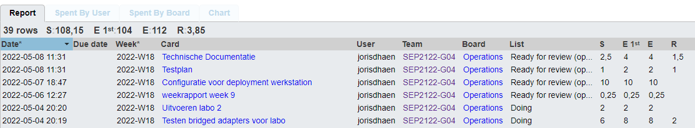
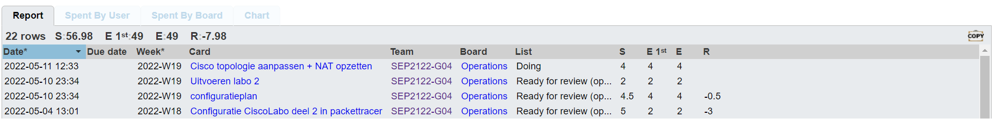

# Voortgangsrapport week 10

- Groep: 4
- Datum voortgangsgesprek:

| Student            | Aanw. | Opmerking |
| :----------------- | :---- | :-------- |
| Gilles De Praeter  |       |           |
| Jarne Bottelberghe |       |           |
| Jordy Vanneste     |       |           |
| Joris D'haen       |       |           |
| Nathan Staelens    |       |           |

## Wat heb je deze week gerealiseerd?

### Algemeen

### Gilles De Praeter

- bridged adapters afgewerkt en fouten er nog uitgehaald + getest
- MDT geïnstalleerd + testrapport
- cisco labo 2 uitgevoerd

[Afbeelding individueel rapport tijdregistratie]

### Jarne Bottelberghe

- Cisco Labo 2 troubleshoot
- Cisco labo 2 fysiek uitgevoerd
- opzetten email server

### Jordy Vanneste

- ...

[Afbeelding individueel rapport tijdregistratie]

### Joris D'haen

- MDT configuratie afgewerkt
- Testplan MDT opgesteld
- Uitvoeren van het cisco labo 2

### Nathan Staelens

- Cisco Labo 2 troubleshoot
- Cisco labo 2 fysiek uitgevoerd
- Opstelling netwerk: vlan, router on a stick, dhcp, pat + configuratieplan

## Wat plan je volgende week te doen?

### Algemeen

### Gilles De Praeter

- De netwerkomgeving opzetten + testen
- laatste details afwerken zoals een volledig config plan voor de demo

### Jarne Bottelberghe

- Afmaken email server en dan alles samen opzetten in netwerk
- laatste details afwerken zoals een volledig config plan voor de demo

### Jordy Vanneste

### Joris D'haen

- Heel de omgeving testen aan de hand van bridged adapters
- Laatste testen uitvoeren voor de email server
- Testplan email server afwerken

### Nathan Staelens

## Waar hebben jullie nog problemen mee?

- ...
- ...

## Feedback technisch luik

### Algemeen

### Gilles De Praeter

### Jarne Bottelberghe

### Jordy Vanneste

### Joris D'haen

### Nathan Staelens

## Feedback analyseluik

### Algemeen

### Gilles De Praeter

### Jarne Bottelberghe

### Jordy Vanneste

### Joris D'haen

### Nathan Staelens
