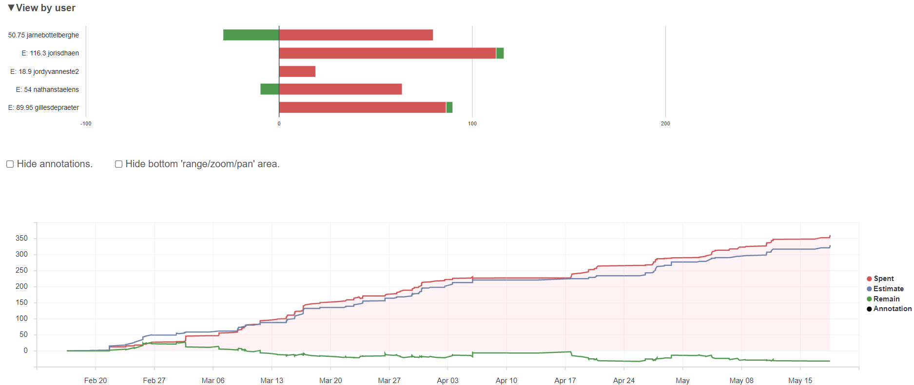

# Voortgangsrapport week 10

- Groep: 4
- Datum voortgangsgesprek:

| Student            | Aanw. | Opmerking |
| :----------------- | :---- | :-------- |
| Gilles De Praeter  |       |           |
| Jarne Bottelberghe |       |           |
| Jordy Vanneste     |       |           |
| Joris D'haen       |       |           |
| Nathan Staelens    |       |           |

## Wat heb je deze week gerealiseerd?

### Algemeen

### Gilles De Praeter

* Testen van de volledige omgeving adhv bridged adapters en een router

### Jarne Bottelberghe

* Testen van de volledige omgeving adhv bridged adapters en een router

### Jordy Vanneste

### Joris D'haen

* Testen van de volledige omgeving adhv bridged adapters en een router

 

### Nathan Staelens

* Testen van de volledige omgeving adhv bridged adapters en een router

## Wat plan je volgende week te doen?

### Algemeen

### Gilles De Praeter

* volledige opstelling voorstellen + alle laatste details afwerken

### Jarne Bottelberghe

* Volledige opstelling voorstellen + alle laatste details afwerken

### Jordy Vanneste

### Joris D'haen

* Volledige opstelling voorstellen

### Nathan Staelens

* Volledige opstelling voorstellen + alle laatste details afwerken

## Waar hebben jullie nog problemen mee?

- ...
- ...

## Feedback technisch luik

### Algemeen

### Gilles De Praeter

### Jarne Bottelberghe

### Jordy Vanneste

### Joris D'haen

### Nathan Staelens

## Feedback analyseluik

### Algemeen

### Gilles De Praeter

### Jarne Bottelberghe

### Jordy Vanneste

### Joris D'haen

### Nathan Staelens
