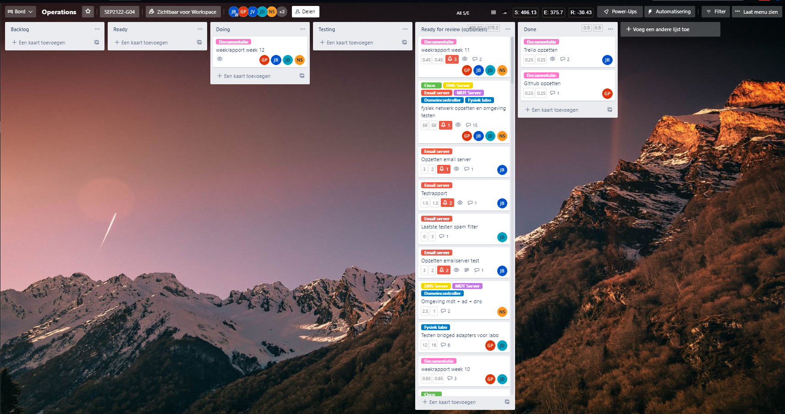
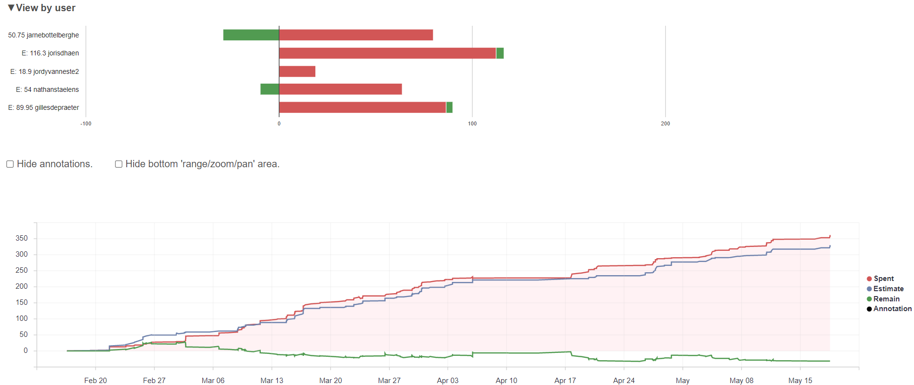
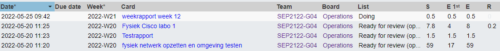
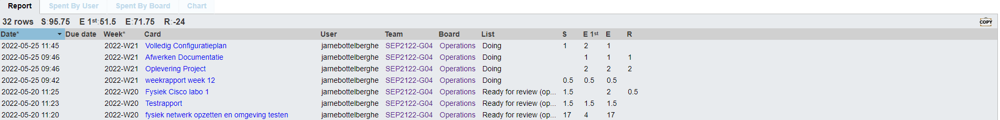
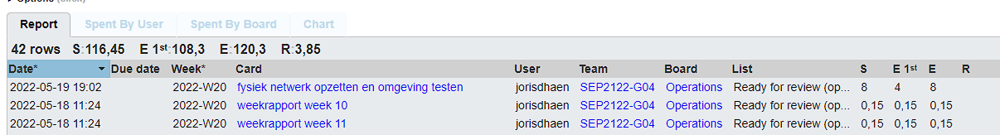
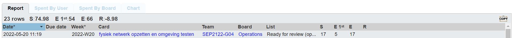

# Voortgangsrapport week 12

* Groep: 4 
* Datum voortgangsgesprek: 

| Student            | Aanw. | Opmerking |
| :----------------- | :---- | :-------- |
| Gilles De Praeter  |       |           |
| Jarne Bottelberghe |       |           |
| Jordy Vanneste     |       |           |
| Joris D'haen       |       |           |
| Nathan Staelens    |       |           |

## Wat heb je deze week gerealiseerd?

### Algemeen

### Gilles De Praeter

* ...

[Afbeelding individueel rapport tijdregistratie]

### Jarne Bottelberghe

* opschonen documentatie
* fysiek netwerk volledig opzetten,troubleshooten en testen

### Jordy Vanneste

* ...

[Afbeelding individueel rapport tijdregistratie]

### Joris D'haen

* Opschonen documentatie
* Fysiek netwerk volledig opzetten,troubleshooten en testen

### Nathan Staelens

* fysiek netwerk volledig opzetten,troubleshooten en testen

## Wat plan je volgende week te doen?

### Algemeen

### Gilles De Praeter

### Jarne Bottelberghe

### Jordy Vanneste

### Joris D'haen

### Nathan Staelens

## Waar hebben jullie nog problemen mee?

* ...
* ...

## Feedback technisch luik

### Algemeen

### Gilles De Praeter

### Jarne Bottelberghe

### Jordy Vanneste

### Joris D'haen

### Nathan Staelens

## Feedback analyseluik

### Algemeen

### Gilles De Praeter

### Jarne Bottelberghe

### Jordy Vanneste

### Joris D'haen

### Nathan Staelens